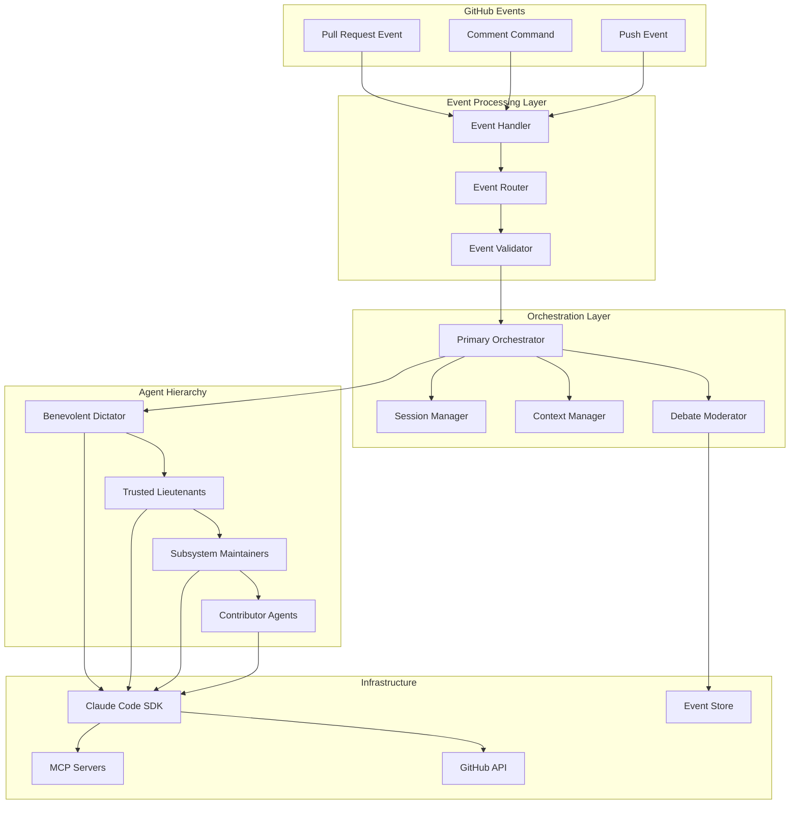
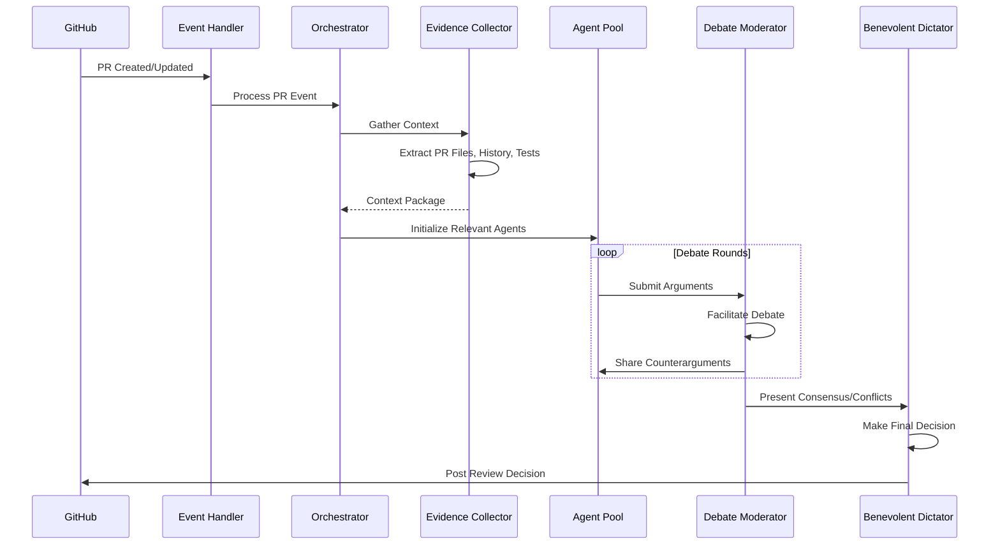
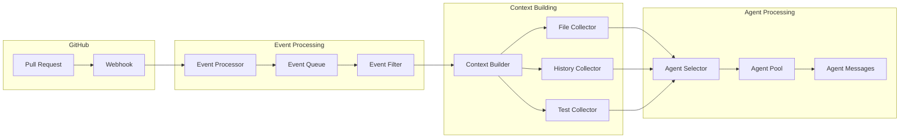

# Agent Architecture for LLM-Driven Pull Request Review System

## Table of Contents

1. [System Overview](#1-system-overview)
2. [Agent Hierarchy (Linux Kernel Inspired)](#2-agent-hierarchy-linux-kernel-inspired)
3. [Agent Types and Responsibilities](#3-agent-types-and-responsibilities)
4. [Communication Protocols](#4-communication-protocols)
5. [Technical Implementation](#5-technical-implementation)
6. [Data Flow](#6-data-flow)
7. [State Management](#7-state-management)

## 1. System Overview

### 1.1 High-Level Architecture



### 1.2 Core Components

#### Event Processing Layer
- **Event Handler**: Receives GitHub webhooks and transforms them into internal events
- **Event Router**: Determines which agents should process each event based on type and content
- **Event Validator**: Ensures event schema compliance and security checks

#### Orchestration Layer
- **Primary Orchestrator**: Coordinates all agent activities and manages the overall workflow
- **Session Manager**: Handles Claude Code SDK sessions for each agent
- **Context Manager**: Manages shared context and memory across agents
- **Debate Moderator**: Facilitates structured debates between agents

#### Agent Layer
- **Benevolent Dictator**: Final decision maker on architectural and integration issues
- **Trusted Lieutenants**: Domain experts with delegated authority
- **Subsystem Maintainers**: Component-specific reviewers
- **Contributor Agents**: Specialized agents for specific tasks

### 1.3 Event Flow from PR Creation to Merge Decision



## 2. Agent Hierarchy (Linux Kernel Inspired)

### 2.1 Benevolent Dictator (Primary Orchestrator)

**Role**: Final arbiter of technical decisions, similar to Linus Torvalds in Linux kernel development.

**Characteristics**:
- Ultimate decision-making authority
- Breaks ties when consensus cannot be reached
- Maintains project vision and architectural consistency
- Reviews decisions from Trusted Lieutenants

**Implementation**:
```typescript
class BenevolentDictator extends BaseAgent {
  constructor() {
    super({
      systemPrompt: `You are the chief architect with final decision authority.
        Your role is to:
        - Make final decisions when agents cannot reach consensus
        - Ensure architectural consistency across the codebase
        - Balance competing concerns from different stakeholders
        - Maintain long-term project vision`,
      model: 'claude-3-opus-20240229',
      temperature: 0.3  // Lower temperature for consistent decisions
    });
  }
  
  async makeFinalDecision(debateHistory: DebateHistory): Promise<Decision> {
    const context = this.synthesizeDebate(debateHistory);
    return await this.evaluateAndDecide(context);
  }
}
```

### 2.2 Trusted Lieutenants (Domain Maintainers)

**Role**: Senior agents with deep expertise in major subsystems.

**Domains**:
- Security Lieutenant
- Performance Lieutenant
- Architecture Lieutenant
- Testing Lieutenant

**Trust Mechanism**:
```typescript
interface TrustMetrics {
  successRate: number;        // Percentage of accepted decisions
  qualityScore: number;       // Average quality of contributions
  domainExpertise: number;    // Depth of knowledge in domain
  peerEndorsements: number;   // Endorsements from other agents
}

class TrustedLieutenant extends BaseAgent {
  private trustScore: number;
  private domain: string;
  
  constructor(domain: string, trustMetrics: TrustMetrics) {
    super({
      systemPrompt: `You are a trusted lieutenant for ${domain}.
        You have delegated authority to approve changes in your domain.`,
      model: 'claude-3-opus-20240229',
      temperature: 0.4
    });
    
    this.domain = domain;
    this.trustScore = this.calculateTrustScore(trustMetrics);
  }
  
  canAutoApprove(): boolean {
    return this.trustScore > 0.9;
  }
}
```

### 2.3 Subsystem Maintainers (Component Owners)

**Role**: Responsible for specific components or features.

**Examples**:
- API Endpoint Maintainer
- Database Schema Maintainer
- Frontend Component Maintainer
- CI/CD Pipeline Maintainer

**MAINTAINERS.yaml Configuration**:
```yaml
subsystems:
  - name: "Authentication System"
    maintainer_agent: "auth-maintainer"
    trust_level: 0.85
    auto_approve_threshold: 0.90
    file_patterns:
      - "src/auth/**"
      - "tests/auth/**"
    expertise:
      - "OAuth 2.0"
      - "JWT tokens"
      - "Session management"
      
  - name: "API Gateway"
    maintainer_agent: "api-maintainer"
    trust_level: 0.88
    file_patterns:
      - "src/api/**"
      - "openapi.yaml"
    review_requirements:
      - "Rate limiting check"
      - "Authentication verification"
      - "Input validation"
```

### 2.4 Contributors (Stakeholder Agents)

**Role**: Specialized agents advocating for specific concerns.

**Types**:
- Security Champion
- Performance Analyst
- UX Advocate
- Accessibility Expert
- Documentation Specialist

## 3. Agent Types and Responsibilities

### 3.1 Maintainer Agents (Decision Makers)

#### Architecture Maintainer
```typescript
class ArchitectureMaintainer extends MaintainerAgent {
  responsibilities = [
    'Ensure design pattern consistency',
    'Review system integration points',
    'Validate architectural decisions',
    'Manage technical debt'
  ];
  
  async reviewChange(change: CodeChange): Promise<Review> {
    const analysis = await this.analyzeArchitecturalImpact(change);
    
    if (analysis.breaksPatterns) {
      return this.requestRefactoring(analysis);
    }
    
    if (analysis.introducesDebt) {
      return this.proposeDebtMitigation(analysis);
    }
    
    return this.approve(analysis);
  }
}
```

#### Security Maintainer
```typescript
class SecurityMaintainer extends MaintainerAgent {
  responsibilities = [
    'Identify security vulnerabilities',
    'Enforce security policies',
    'Review authentication/authorization',
    'Validate input sanitization'
  ];
  
  async reviewChange(change: CodeChange): Promise<Review> {
    const securityScan = await this.performSecurityAnalysis(change);
    
    if (securityScan.criticalIssues.length > 0) {
      return this.blockWithSecurityConcerns(securityScan);
    }
    
    return this.approveWithRecommendations(securityScan);
  }
}
```

### 3.2 Stakeholder Agents (Advocates)

#### Performance Advocate
```typescript
class PerformanceAdvocate extends StakeholderAgent {
  async analyzeImpact(change: CodeChange): Promise<PerformanceAnalysis> {
    return {
      timeComplexity: this.analyzeAlgorithmicComplexity(change),
      spaceComplexity: this.analyzeMemoryUsage(change),
      databaseImpact: this.analyzeDatabaseQueries(change),
      recommendations: this.generateOptimizations(change)
    };
  }
  
  async participateInDebate(topic: string): Promise<Argument> {
    return {
      position: this.formPosition(topic),
      evidence: await this.gatherPerformanceMetrics(topic),
      priority: this.assessPerformanceImpact(topic)
    };
  }
}
```

### 3.3 Orchestrator Agent (Debate Moderator)

```typescript
class DebateOrchestrator extends BaseAgent {
  private agents: Map<string, Agent>;
  private debateState: DebateState;
  
  async facilitateDebate(topic: string, participants: string[]): Promise<DebateOutcome> {
    // Initialize debate
    this.debateState = this.initializeDebate(topic, participants);
    
    // Conduct rounds
    for (let round = 0; round < this.config.maxRounds; round++) {
      const arguments = await this.collectArguments(round);
      const synthesis = await this.synthesizePositions(arguments);
      
      if (this.hasReachedConsensus(synthesis)) {
        return this.finalizeConsensus(synthesis);
      }
      
      await this.shareCounterarguments(arguments);
    }
    
    // No consensus - escalate to Benevolent Dictator
    return this.escalateDecision(this.debateState);
  }
  
  private async collectArguments(round: number): Promise<Map<string, Argument>> {
    const arguments = new Map();
    
    for (const [agentId, agent] of this.agents) {
      const argument = await agent.provideArgument(
        this.debateState.topic,
        this.debateState.history,
        round
      );
      arguments.set(agentId, argument);
    }
    
    return arguments;
  }
}
```

### 3.4 Evidence Collector Agent (Context Builder)

```typescript
class EvidenceCollector extends BaseAgent {
  async buildContext(event: PREvent): Promise<ReviewContext> {
    const context = {
      files: await this.loadRelevantFiles(event),
      history: await this.getRelevantHistory(event),
      relatedIssues: await this.findRelatedIssues(event),
      testResults: await this.getTestResults(event),
      dependencies: await this.analyzeDependencies(event),
      metrics: await this.gatherMetrics(event)
    };
    
    // Optimize context for token usage
    return this.optimizeContext(context);
  }
  
  private async loadRelevantFiles(event: PREvent): Promise<FileContext[]> {
    const files = await this.getPRFiles(event);
    const relevantFiles = await this.selectRelevantFiles(files);
    
    return Promise.all(
      relevantFiles.map(async (file) => ({
        path: file.path,
        content: await this.loadFileWithTruncation(file),
        changes: this.extractChanges(file),
        impact: await this.assessImpact(file)
      }))
    );
  }
}
```

## 4. Communication Protocols

### 4.1 Event-Driven Messaging System

```typescript
interface AgentMessage {
  id: string;
  type: 'argument' | 'rebuttal' | 'evidence' | 'decision';
  from: string;
  to: string | string[];
  topic: string;
  content: any;
  timestamp: Date;
  priority: 'critical' | 'high' | 'medium' | 'low';
}

class MessageBus {
  private subscribers: Map<string, MessageHandler[]> = new Map();
  
  async publish(message: AgentMessage): Promise<void> {
    // Store message for audit trail
    await this.persistMessage(message);
    
    // Route to subscribers
    const handlers = this.subscribers.get(message.to) || [];
    await Promise.all(
      handlers.map(handler => handler.handle(message))
    );
  }
  
  subscribe(agentId: string, handler: MessageHandler): void {
    const handlers = this.subscribers.get(agentId) || [];
    handlers.push(handler);
    this.subscribers.set(agentId, handlers);
  }
}
```

### 4.2 Debate Protocol Implementation

```typescript
class DebateProtocol {
  private readonly phases = [
    'initialization',
    'opening_arguments',
    'rebuttals',
    'evidence_presentation',
    'synthesis',
    'consensus_building'
  ];
  
  async executeDebate(config: DebateConfig): Promise<DebateResult> {
    const state = new DebateState(config);
    
    for (const phase of this.phases) {
      const phaseResult = await this.executePhase(phase, state);
      state.recordPhaseResult(phase, phaseResult);
      
      if (this.shouldTerminateEarly(state)) {
        break;
      }
    }
    
    return this.compileResults(state);
  }
  
  private async executePhase(phase: string, state: DebateState): Promise<PhaseResult> {
    switch (phase) {
      case 'opening_arguments':
        return await this.collectOpeningArguments(state);
      
      case 'rebuttals':
        return await this.facilitateRebuttals(state);
      
      case 'evidence_presentation':
        return await this.presentEvidence(state);
      
      case 'synthesis':
        return await this.synthesizePositions(state);
      
      case 'consensus_building':
        return await this.buildConsensus(state);
      
      default:
        throw new Error(`Unknown phase: ${phase}`);
    }
  }
}
```

### 4.3 Consensus Mechanisms

```typescript
class ConsensusMechanism {
  async evaluateConsensus(positions: Map<string, Position>): Promise<ConsensusResult> {
    const voting = this.calculateVotes(positions);
    const weights = this.applyTrustWeights(voting);
    
    return {
      hasConsensus: this.meetsConsensusThreshold(weights),
      consensusLevel: this.calculateConsensusLevel(weights),
      dissenting: this.identifyDissenters(weights),
      recommendation: this.formRecommendation(weights)
    };
  }
  
  private calculateVotes(positions: Map<string, Position>): VotingResult {
    const votes = {
      approve: [],
      reject: [],
      conditional: []
    };
    
    for (const [agentId, position] of positions) {
      votes[position.vote].push({
        agentId,
        reasoning: position.reasoning,
        confidence: position.confidence
      });
    }
    
    return votes;
  }
  
  private applyTrustWeights(voting: VotingResult): WeightedVotes {
    // Apply trust scores and domain expertise weights
    const weighted = {};
    
    for (const category of ['approve', 'reject', 'conditional']) {
      weighted[category] = voting[category].reduce((sum, vote) => {
        const agent = this.getAgent(vote.agentId);
        const weight = agent.trustScore * vote.confidence;
        return sum + weight;
      }, 0);
    }
    
    return weighted;
  }
}
```

### 4.4 Escalation Procedures

```typescript
class EscalationManager {
  private escalationChain = [
    'subsystem_maintainer',
    'trusted_lieutenant',
    'benevolent_dictator',
    'human_intervention'
  ];
  
  async escalate(issue: Issue, currentLevel: number): Promise<Resolution> {
    const nextLevel = this.escalationChain[currentLevel + 1];
    
    if (!nextLevel) {
      throw new Error('Maximum escalation reached');
    }
    
    const escalationContext = {
      issue,
      previousAttempts: issue.resolutionAttempts,
      debateHistory: issue.debateHistory,
      urgency: this.calculateUrgency(issue)
    };
    
    switch (nextLevel) {
      case 'trusted_lieutenant':
        return await this.escalateToLieutenant(escalationContext);
      
      case 'benevolent_dictator':
        return await this.escalateToDictator(escalationContext);
      
      case 'human_intervention':
        return await this.requestHumanIntervention(escalationContext);
      
      default:
        return await this.standardEscalation(nextLevel, escalationContext);
    }
  }
}
```

## 5. Technical Implementation

### 5.1 Claude Code SDK Integration

```typescript
import { ClaudeCode, Session } from '@anthropic/claude-code-sdk';

class AgentSessionManager {
  private sdk: ClaudeCode;
  private sessions: Map<string, Session> = new Map();
  private mcpServers: Map<string, MCPServer> = new Map();
  
  constructor(apiKey: string) {
    this.sdk = new ClaudeCode({
      apiKey,
      maxRetries: 3,
      timeout: 30000
    });
  }
  
  async createAgentSession(agentConfig: AgentConfig): Promise<Session> {
    // Set up MCP servers for the agent
    const mcpConfig = await this.configureMCPServers(agentConfig);
    
    // Create session with role-specific configuration
    const session = await this.sdk.createSession({
      systemPrompt: agentConfig.systemPrompt,
      tools: agentConfig.tools,
      mcpServers: mcpConfig,
      temperature: agentConfig.temperature || 0.5,
      maxTokens: agentConfig.maxTokens || 4096
    });
    
    // Store session for reuse
    this.sessions.set(agentConfig.id, session);
    
    // Load CLAUDE.md if exists
    await this.loadAgentContext(session, agentConfig);
    
    return session;
  }
  
  private async configureMCPServers(config: AgentConfig): Promise<MCPConfig[]> {
    const servers = [];
    
    // File system access
    servers.push({
      command: 'npx',
      args: ['-y', '@modelcontextprotocol/server-filesystem', config.workspacePath]
    });
    
    // GitHub integration
    if (config.needsGitHub) {
      servers.push({
        command: 'npx',
        args: ['-y', '@modelcontextprotocol/server-github'],
        env: { GITHUB_TOKEN: process.env.GITHUB_TOKEN }
      });
    }
    
    // Custom tools for specific agents
    if (config.customTools) {
      servers.push({
        command: config.customTools.command,
        args: config.customTools.args,
        env: config.customTools.env
      });
    }
    
    return servers;
  }
}
```

### 5.2 GitHub Actions Workflows

```yaml
name: AI Agent Code Review
on:
  pull_request:
    types: [opened, synchronize, reopened]
  issue_comment:
    types: [created]

jobs:
  trigger-review:
    runs-on: ubuntu-latest
    if: |
      github.event_name == 'pull_request' || 
      (github.event_name == 'issue_comment' && contains(github.event.comment.body, '/review'))
    
    steps:
      - uses: actions/checkout@v4
        with:
          fetch-depth: 0  # Full history for context
      
      - name: Setup Agent Environment
        uses: anthropics/claude-code-action@v1
        with:
          api-key: ${{ secrets.ANTHROPIC_API_KEY }}
      
      - name: Initialize Agent System
        id: init
        run: |
          # Create configuration
          cat > agent-config.json << EOF
          {
            "pr_number": "${{ github.event.pull_request.number }}",
            "repository": "${{ github.repository }}",
            "event_type": "${{ github.event_name }}",
            "agents": [
              "architecture-maintainer",
              "security-champion",
              "performance-analyst",
              "testing-specialist"
            ],
            "debate_rounds": 3,
            "consensus_threshold": 0.75
          }
          EOF
      
      - name: Execute Agent Review
        uses: ./.github/actions/agent-review
        with:
          config-file: agent-config.json
          github-token: ${{ secrets.GITHUB_TOKEN }}

  orchestrate-debate:
    needs: trigger-review
    runs-on: ubuntu-latest
    strategy:
      matrix:
        agent: [architect, security, performance, testing]
    
    steps:
      - name: Initialize Agent ${{ matrix.agent }}
        uses: anthropics/claude-code-action@v1
        with:
          api-key: ${{ secrets.ANTHROPIC_API_KEY }}
          session-id: review-${{ github.run_id }}-${{ matrix.agent }}
          system-prompt-file: .github/agents/${{ matrix.agent }}.md
      
      - name: Agent Analysis
        id: analysis
        run: |
          # Agent performs its specialized analysis
          claude-code analyze \
            --agent ${{ matrix.agent }} \
            --pr ${{ github.event.pull_request.number }} \
            --output analysis-${{ matrix.agent }}.json
      
      - name: Upload Analysis
        uses: actions/upload-artifact@v3
        with:
          name: analysis-${{ matrix.agent }}
          path: analysis-${{ matrix.agent }}.json

  synthesize-results:
    needs: orchestrate-debate
    runs-on: ubuntu-latest
    steps:
      - name: Download All Analyses
        uses: actions/download-artifact@v3
        with:
          path: analyses/
      
      - name: Run Consensus Building
        uses: anthropics/claude-code-action@v1
        with:
          api-key: ${{ secrets.ANTHROPIC_API_KEY }}
          command: |
            claude-code synthesize \
              --analyses analyses/ \
              --output consensus.json
      
      - name: Post Review Results
        uses: actions/github-script@v7
        with:
          script: |
            const fs = require('fs');
            const consensus = JSON.parse(fs.readFileSync('consensus.json', 'utf8'));
            
            // Create review based on consensus
            const review = {
              owner: context.repo.owner,
              repo: context.repo.repo,
              pull_number: context.issue.number,
              body: consensus.summary,
              event: consensus.decision === 'approve' ? 'APPROVE' : 
                     consensus.decision === 'reject' ? 'REQUEST_CHANGES' : 
                     'COMMENT',
              comments: consensus.line_comments
            };
            
            await github.rest.pulls.createReview(review);
```

### 5.3 MCP Server Architecture

```typescript
// Custom MCP server for code review tools
import { MCPServer, Tool } from '@modelcontextprotocol/sdk';

class CodeReviewMCPServer extends MCPServer {
  constructor() {
    super({
      name: 'code-review-tools',
      version: '1.0.0',
      description: 'Specialized tools for AI code review'
    });
    
    this.registerTools();
  }
  
  private registerTools() {
    // Security scanning tool
    this.registerTool({
      name: 'security_scan',
      description: 'Scan code for security vulnerabilities',
      inputSchema: {
        type: 'object',
        properties: {
          files: { type: 'array', items: { type: 'string' } },
          scanType: { type: 'string', enum: ['full', 'quick', 'dependencies'] }
        }
      },
      handler: async ({ files, scanType }) => {
        return await this.performSecurityScan(files, scanType);
      }
    });
    
    // Performance profiling tool
    this.registerTool({
      name: 'performance_profile',
      description: 'Profile code performance characteristics',
      inputSchema: {
        type: 'object',
        properties: {
          code: { type: 'string' },
          metrics: { type: 'array', items: { type: 'string' } }
        }
      },
      handler: async ({ code, metrics }) => {
        return await this.profilePerformance(code, metrics);
      }
    });
    
    // Architecture analysis tool
    this.registerTool({
      name: 'architecture_check',
      description: 'Analyze architectural patterns and violations',
      inputSchema: {
        type: 'object',
        properties: {
          component: { type: 'string' },
          patterns: { type: 'array', items: { type: 'string' } }
        }
      },
      handler: async ({ component, patterns }) => {
        return await this.checkArchitecture(component, patterns);
      }
    });
  }
}
```

### 5.4 Session Management

```typescript
class SessionManager {
  private sessions: Map<string, AgentSession> = new Map();
  private contextStore: ContextStore;
  
  async createSession(agentId: string, config: SessionConfig): Promise<AgentSession> {
    const session = new AgentSession({
      id: `${agentId}-${Date.now()}`,
      agentId,
      config,
      startTime: new Date()
    });
    
    // Initialize with shared context
    const sharedContext = await this.contextStore.getSharedContext();
    await session.loadContext(sharedContext);
    
    // Load agent-specific context
    const agentContext = await this.contextStore.getAgentContext(agentId);
    await session.loadContext(agentContext);
    
    this.sessions.set(session.id, session);
    return session;
  }
  
  async persistSession(sessionId: string): Promise<void> {
    const session = this.sessions.get(sessionId);
    if (!session) return;
    
    const state = {
      id: session.id,
      agentId: session.agentId,
      decisions: session.getDecisions(),
      context: session.getContext(),
      metrics: session.getMetrics()
    };
    
    await this.contextStore.saveSessionState(state);
  }
  
  async resumeSession(sessionId: string): Promise<AgentSession> {
    const state = await this.contextStore.loadSessionState(sessionId);
    const session = new AgentSession(state);
    
    this.sessions.set(session.id, session);
    return session;
  }
}
```

## 6. Data Flow

### 6.1 PR Event Triggers



### 6.2 Context Extraction and Enrichment

```typescript
class ContextEnricher {
  async enrichPRContext(event: PREvent): Promise<EnrichedContext> {
    const baseContext = await this.extractBaseContext(event);
    
    // Layer 1: File Analysis
    const fileContext = await this.analyzeFiles(baseContext.files);
    
    // Layer 2: Historical Context
    const historicalContext = await this.gatherHistory({
      author: event.author,
      files: baseContext.files,
      timeRange: 30 // days
    });
    
    // Layer 3: Dependency Analysis
    const dependencyContext = await this.analyzeDependencies(baseContext);
    
    // Layer 4: Test Coverage
    const testContext = await this.analyzeTestCoverage(baseContext);
    
    // Layer 5: Performance Baselines
    const performanceContext = await this.gatherPerformanceBaselines();
    
    return {
      base: baseContext,
      files: fileContext,
      history: historicalContext,
      dependencies: dependencyContext,
      tests: testContext,
      performance: performanceContext,
      metadata: {
        extractedAt: new Date(),
        tokenCount: this.countTokens(baseContext),
        compressionRatio: this.calculateCompression()
      }
    };
  }
}
```

### 6.3 Agent Invocation Sequence

```typescript
class AgentInvocationManager {
  private readonly invocationOrder = [
    { phase: 'initial', agents: ['evidence-collector'] },
    { phase: 'analysis', agents: ['security', 'performance', 'architecture'], parallel: true },
    { phase: 'review', agents: ['subsystem-maintainers'], parallel: true },
    { phase: 'debate', agents: ['all-stakeholders'], parallel: false },
    { phase: 'decision', agents: ['trusted-lieutenants', 'benevolent-dictator'] }
  ];
  
  async executeInvocationSequence(context: ReviewContext): Promise<ReviewOutcome> {
    const results = new Map<string, AgentResult>();
    
    for (const phase of this.invocationOrder) {
      const phaseResults = await this.executePhase(phase, context, results);
      
      // Update context with phase results
      context = this.updateContext(context, phaseResults);
      
      // Check for early termination
      if (this.shouldTerminate(phaseResults)) {
        break;
      }
    }
    
    return this.compileOutcome(results);
  }
  
  private async executePhase(
    phase: InvocationPhase,
    context: ReviewContext,
    previousResults: Map<string, AgentResult>
  ): Promise<PhaseResult> {
    if (phase.parallel) {
      return await this.executeParallel(phase.agents, context, previousResults);
    } else {
      return await this.executeSequential(phase.agents, context, previousResults);
    }
  }
}
```

### 6.4 Decision Aggregation

```typescript
class DecisionAggregator {
  async aggregateDecisions(
    agentDecisions: Map<string, Decision>,
    trustScores: Map<string, number>
  ): Promise<AggregatedDecision> {
    // Calculate weighted votes
    const weightedVotes = this.calculateWeightedVotes(agentDecisions, trustScores);
    
    // Identify consensus level
    const consensusLevel = this.calculateConsensusLevel(weightedVotes);
    
    // Determine final decision
    let finalDecision: string;
    if (consensusLevel > 0.75) {
      finalDecision = this.getMajorityDecision(weightedVotes);
    } else {
      // No strong consensus - needs escalation
      finalDecision = 'escalate';
    }
    
    // Compile reasoning
    const reasoning = this.compileReasoning(agentDecisions, finalDecision);
    
    // Generate action items
    const actionItems = this.extractActionItems(agentDecisions);
    
    return {
      decision: finalDecision,
      consensusLevel,
      reasoning,
      actionItems,
      dissenting: this.identifyDissenting(agentDecisions, finalDecision),
      confidence: this.calculateConfidence(weightedVotes, consensusLevel)
    };
  }
  
  private calculateWeightedVotes(
    decisions: Map<string, Decision>,
    trustScores: Map<string, number>
  ): Map<string, number> {
    const votes = new Map<string, number>();
    
    for (const [agentId, decision] of decisions) {
      const trust = trustScores.get(agentId) || 0.5;
      const weight = trust * decision.confidence;
      
      const current = votes.get(decision.vote) || 0;
      votes.set(decision.vote, current + weight);
    }
    
    return votes;
  }
}
```

## 7. State Management

### 7.1 Debate State Tracking

```typescript
interface DebateState {
  id: string;
  topic: string;
  phase: DebatePhase;
  participants: Map<string, AgentState>;
  rounds: Round[];
  currentRound: number;
  consensusMetrics: ConsensusMetrics;
  decisions: Decision[];
  startTime: Date;
  lastActivity: Date;
}

class DebateStateManager {
  private states: Map<string, DebateState> = new Map();
  private storage: StateStorage;
  
  async createDebate(config: DebateConfig): Promise<DebateState> {
    const state: DebateState = {
      id: generateId(),
      topic: config.topic,
      phase: 'initialization',
      participants: new Map(),
      rounds: [],
      currentRound: 0,
      consensusMetrics: this.initializeMetrics(),
      decisions: [],
      startTime: new Date(),
      lastActivity: new Date()
    };
    
    // Initialize participants
    for (const agentId of config.participants) {
      state.participants.set(agentId, {
        id: agentId,
        status: 'active',
        contributions: [],
        position: null
      });
    }
    
    this.states.set(state.id, state);
    await this.persistState(state);
    
    return state;
  }
  
  async updateState(debateId: string, update: StateUpdate): Promise<void> {
    const state = this.states.get(debateId);
    if (!state) throw new Error(`Debate ${debateId} not found`);
    
    // Apply update
    switch (update.type) {
      case 'phase_change':
        state.phase = update.newPhase;
        break;
        
      case 'round_complete':
        state.rounds.push(update.roundData);
        state.currentRound++;
        break;
        
      case 'participant_contribution':
        const participant = state.participants.get(update.agentId);
        participant.contributions.push(update.contribution);
        break;
        
      case 'consensus_update':
        state.consensusMetrics = update.metrics;
        break;
    }
    
    state.lastActivity = new Date();
    await this.persistState(state);
  }
}
```

### 7.2 Agent Decision History

```typescript
interface DecisionRecord {
  id: string;
  agentId: string;
  debateId: string;
  timestamp: Date;
  decision: {
    vote: 'approve' | 'reject' | 'conditional';
    reasoning: string;
    evidence: Evidence[];
    confidence: number;
  };
  context: {
    codeChanges: string[];
    relatedDecisions: string[];
    externalFactors: string[];
  };
  outcome: {
    accepted: boolean;
    impact: string;
    feedback: string;
  };
}

class DecisionHistoryManager {
  private history: DecisionRecord[] = [];
  private index: Map<string, DecisionRecord[]> = new Map();
  
  async recordDecision(record: DecisionRecord): Promise<void> {
    this.history.push(record);
    
    // Index by agent
    const agentHistory = this.index.get(record.agentId) || [];
    agentHistory.push(record);
    this.index.set(record.agentId, agentHistory);
    
    // Persist to storage
    await this.storage.append('decisions', record);
    
    // Update agent metrics
    await this.updateAgentMetrics(record);
  }
  
  async getAgentHistory(agentId: string, filter?: HistoryFilter): Promise<DecisionRecord[]> {
    let history = this.index.get(agentId) || [];
    
    if (filter) {
      history = history.filter(record => {
        if (filter.dateRange) {
          if (record.timestamp < filter.dateRange.start || 
              record.timestamp > filter.dateRange.end) {
            return false;
          }
        }
        
        if (filter.decisionType && record.decision.vote !== filter.decisionType) {
          return false;
        }
        
        if (filter.minConfidence && record.decision.confidence < filter.minConfidence) {
          return false;
        }
        
        return true;
      });
    }
    
    return history;
  }
  
  async analyzeDecisionPatterns(agentId: string): Promise<PatternAnalysis> {
    const history = await this.getAgentHistory(agentId);
    
    return {
      totalDecisions: history.length,
      approvalRate: this.calculateApprovalRate(history),
      averageConfidence: this.calculateAverageConfidence(history),
      commonReasons: this.extractCommonReasons(history),
      decisionAccuracy: this.calculateAccuracy(history),
      improvementTrend: this.calculateTrend(history)
    };
  }
}
```

### 7.3 Checkpoint and Resume Capabilities

```typescript
class CheckpointManager {
  private checkpointInterval = 5; // rounds
  private storage: CheckpointStorage;
  
  async createCheckpoint(debate: DebateState): Promise<string> {
    const checkpoint: Checkpoint = {
      id: generateCheckpointId(),
      debateId: debate.id,
      timestamp: new Date(),
      state: this.serializeState(debate),
      metadata: {
        round: debate.currentRound,
        phase: debate.phase,
        participantCount: debate.participants.size,
        consensusLevel: debate.consensusMetrics.level
      }
    };
    
    await this.storage.save(checkpoint);
    return checkpoint.id;
  }
  
  async resumeFromCheckpoint(checkpointId: string): Promise<ResumedDebate> {
    const checkpoint = await this.storage.load(checkpointId);
    const debate = this.deserializeState(checkpoint.state);
    
    // Recreate agent sessions
    const agents = new Map<string, Agent>();
    for (const [agentId, agentState] of debate.participants) {
      const agent = await this.recreateAgent(agentId, agentState);
      agents.set(agentId, agent);
    }
    
    // Restore context
    const context = await this.restoreContext(checkpoint);
    
    return {
      debate,
      agents,
      context,
      resumedFrom: checkpoint.metadata.round
    };
  }
  
  private async recreateAgent(agentId: string, state: AgentState): Promise<Agent> {
    const config = await this.getAgentConfig(agentId);
    const agent = await this.agentFactory.create(config);
    
    // Restore agent state
    await agent.loadState(state);
    
    // Replay critical decisions for context
    const criticalContributions = state.contributions
      .filter(c => c.impact === 'high')
      .slice(-5); // Last 5 critical contributions
    
    await agent.replayContext(criticalContributions);
    
    return agent;
  }
  
  async autoCheckpoint(debate: DebateState): Promise<void> {
    if (debate.currentRound % this.checkpointInterval === 0) {
      await this.createCheckpoint(debate);
    }
  }
}
```

### 7.4 State Persistence and Recovery

```typescript
class StateRecoveryManager {
  private readonly stateTypes = ['debate', 'agent', 'decision', 'context'];
  
  async backupState(): Promise<BackupResult> {
    const backup = {
      id: generateBackupId(),
      timestamp: new Date(),
      states: {}
    };
    
    for (const type of this.stateTypes) {
      backup.states[type] = await this.exportStateType(type);
    }
    
    const compressed = await this.compress(backup);
    await this.storage.saveBackup(compressed);
    
    return {
      backupId: backup.id,
      size: compressed.length,
      stateCount: Object.keys(backup.states).length
    };
  }
  
  async recoverState(backupId: string): Promise<RecoveryResult> {
    const compressed = await this.storage.loadBackup(backupId);
    const backup = await this.decompress(compressed);
    
    const results = {
      recovered: [],
      failed: [],
      warnings: []
    };
    
    for (const [type, data] of Object.entries(backup.states)) {
      try {
        await this.importStateType(type, data);
        results.recovered.push(type);
      } catch (error) {
        results.failed.push({ type, error: error.message });
      }
    }
    
    // Validate recovered state
    const validation = await this.validateRecoveredState();
    results.warnings = validation.warnings;
    
    return results;
  }
  
  async validateRecoveredState(): Promise<ValidationResult> {
    const issues = [];
    
    // Check state consistency
    const debates = await this.storage.getAllDebates();
    for (const debate of debates) {
      // Verify all participants exist
      for (const agentId of debate.participants.keys()) {
        if (!await this.agentExists(agentId)) {
          issues.push({
            type: 'missing_agent',
            debateId: debate.id,
            agentId
          });
        }
      }
      
      // Verify decision records
      for (const decision of debate.decisions) {
        if (!await this.decisionExists(decision.id)) {
          issues.push({
            type: 'missing_decision',
            debateId: debate.id,
            decisionId: decision.id
          });
        }
      }
    }
    
    return {
      valid: issues.length === 0,
      warnings: issues
    };
  }
}
```

## Architecture Summary

This agent architecture provides a robust, scalable system for automated pull request review using multiple specialized LLM agents. Key features include:

1. **Hierarchical Authority**: Linux kernel-inspired hierarchy ensures clear decision-making paths and accountability

2. **Specialized Agents**: Each agent has specific expertise and responsibilities, enabling deep analysis

3. **Structured Debates**: Formal debate protocols ensure thorough consideration of all perspectives

4. **Event-Driven Architecture**: Reactive system responds efficiently to GitHub events

5. **Token Optimization**: Smart context management and caching minimize costs while maintaining quality

6. **State Management**: Comprehensive state tracking enables debugging, auditing, and recovery

7. **Extensibility**: Modular design allows easy addition of new agent types and capabilities

The system balances automation with human oversight, providing high-quality code reviews while maintaining efficiency and cost-effectiveness.