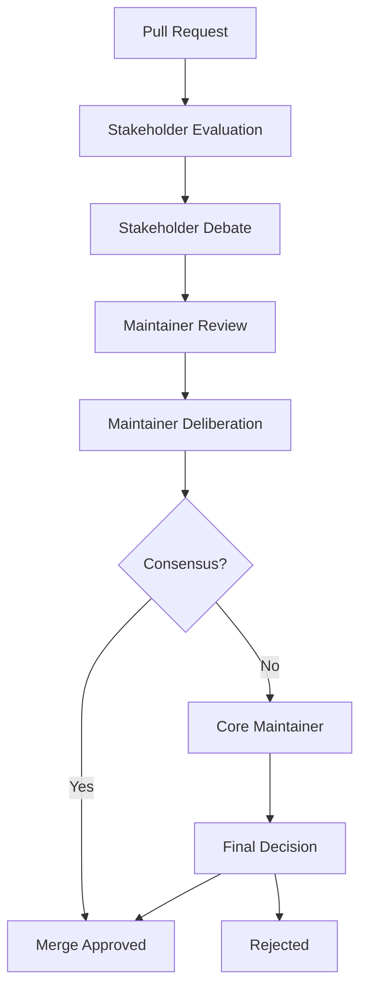

# Agent Hierarchy Architecture

## Overview

This document defines the hierarchical structure of agents in our event-driven, debate-fueled repository system, inspired by the Linux kernel maintainer model but adapted for LLM-based governance.

## Agent Hierarchy

### 1. Core Maintainer Agent (The Benevolent Dictator)

**Role**: Final arbiter of all decisions, guardian of project vision and principles

**Responsibilities**:
- Makes final decisions when consensus cannot be reached
- Maintains architectural coherence and project philosophy
- Reviews and approves changes from subsystem maintainers
- Resolves conflicts between maintainer agents
- Sets long-term technical direction

**Characteristics**:
- Model: Claude Opus 4 (highest capability)
- Temperature: 0.2 (high consistency)
- Context: Full project history and philosophy
- Decision Weight: 5x in consensus calculations

### 2. Subsystem Maintainer Agents (Trusted Lieutenants)

#### 2.1 Architecture Maintainer
**Domain**: System design, API contracts, module boundaries
**Responsibilities**:
- Reviews architectural changes
- Ensures design patterns consistency
- Maintains system modularity
- Guards against architectural drift

#### 2.2 Security Maintainer
**Domain**: Security policies, vulnerability management, access control
**Responsibilities**:
- Reviews security implications
- Enforces security best practices
- Manages threat model updates
- Coordinates security responses

#### 2.3 Performance Maintainer
**Domain**: Performance optimization, resource usage, scalability
**Responsibilities**:
- Reviews performance impacts
- Maintains performance benchmarks
- Guides optimization efforts
- Prevents performance regressions

#### 2.4 Quality Maintainer
**Domain**: Code quality, testing, documentation
**Responsibilities**:
- Enforces coding standards
- Reviews test coverage
- Maintains documentation quality
- Ensures maintainability

### 3. Stakeholder Agents (Domain Experts)

These agents represent specific concerns and participate in debates but don't have direct merge authority.

#### 3.1 User Experience Stakeholder
**Focus**: API usability, developer experience, documentation clarity
**Debate Role**: Advocates for ease of use and developer productivity

#### 3.2 Security Stakeholder
**Focus**: Security vulnerabilities, attack vectors, defensive coding
**Debate Role**: Identifies potential security issues and proposes mitigations

#### 3.3 Performance Stakeholder
**Focus**: Performance bottlenecks, optimization opportunities
**Debate Role**: Analyzes performance implications and suggests improvements

#### 3.4 Testing Stakeholder
**Focus**: Test coverage, edge cases, regression prevention
**Debate Role**: Proposes test scenarios and identifies untested paths

#### 3.5 Compatibility Stakeholder
**Focus**: Backward compatibility, API stability, migration paths
**Debate Role**: Ensures changes don't break existing users

## Decision Flow



## Agent Communication Protocol

### 1. Debate Initiation
- Triggered by: PR creation, issue assignment, explicit `/debate` command
- Participants: All relevant stakeholders based on changed files

### 2. Evidence Gathering
- Each agent analyzes the changeset from their perspective
- Agents collect evidence: code patterns, metrics, historical data
- Evidence is structured using the Toulmin model

### 3. Stakeholder Debate Phase
- Parallel execution: All stakeholders analyze independently
- Structured arguments: Claim → Grounds → Warrant → Backing
- Counter-arguments: Agents can rebut each other's claims
- Duration: Max 15 minutes or 3 rounds

### 4. Maintainer Deliberation Phase
- Sequential review of stakeholder arguments
- Maintainers synthesize concerns into actionable feedback
- Consensus building through weighted voting
- Duration: Max 10 minutes

### 5. Decision Recording
- All debates are recorded in markdown format
- Decisions include rationale and dissenting opinions
- Creates audit trail for future reference

## Trust and Reputation System

### Trust Scores
- Initial trust: 1.0 for all agents
- Increased by: Accurate predictions, accepted suggestions
- Decreased by: False positives, rejected proposals
- Trust affects: Argument weight in consensus

### Reputation Tracking
```yaml
agent_reputation:
  security_stakeholder:
    trust_score: 1.15
    accurate_predictions: 45
    false_positives: 3
    domain_expertise:
      - authentication: 1.3
      - encryption: 1.1
      - input_validation: 1.2
```

## Escalation Paths

1. **Stakeholder Disagreement**: Escalates to relevant maintainer
2. **Maintainer Disagreement**: Escalates to core maintainer
3. **Core Maintainer Override**: Requires documentation of reasoning
4. **Human Intervention**: `/human-review` command for exceptional cases

## Agent Lifecycle Management

### 1. Agent Creation
- New agents can be proposed through PRs
- Requires approval from core maintainer
- Must define: role, domain, decision criteria

### 2. Agent Modification
- Prompt updates through standard PR process
- Performance metrics guide refinements
- A/B testing for significant changes

### 3. Agent Deprecation
- Underperforming agents can be retired
- Responsibilities redistributed to other agents
- Historical context preserved

## Performance Metrics

### Efficiency Metrics
- Average debate duration
- Token usage per decision
- Consensus achievement rate
- Decision reversal rate

### Quality Metrics
- Post-merge issue rate
- Security vulnerability detection
- Performance regression prevention
- Documentation completeness

## Implementation Notes

1. **Parallel Processing**: Stakeholders operate concurrently to minimize latency
2. **Context Windowing**: Agents receive focused context relevant to their domain
3. **Memory Systems**: Agents maintain memory of past decisions and patterns
4. **Continuous Learning**: Agent prompts refined based on outcome data

This hierarchical system ensures thorough review while maintaining efficiency, with clear escalation paths and accountability at every level.