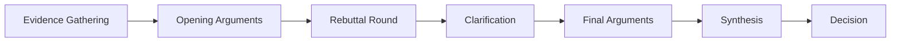

# Debate Protocol for Agent-Driven Code Review

## Overview

This document defines the formal debate structure and rules for our multi-agent code review system. The protocol is based on structured argumentation frameworks, specifically the Toulmin model, adapted for LLM agents.

## Debate Structure

### 1. Debate Triggers

Debates are initiated by the following events:
- **Pull Request Events**: `opened`, `synchronize`, `reopened`
- **Issue Events**: When labeled with `needs-debate`
- **Manual Trigger**: `/debate` command in comments
- **Automated Triggers**: Failed CI checks, security alerts

### 2. Debate Phases



#### Phase 1: Evidence Gathering (5 minutes)
- Agents analyze the changeset independently
- Extract relevant metrics and patterns
- Build evidence repository
- No inter-agent communication

#### Phase 2: Opening Arguments (10 minutes)
- Each stakeholder presents their position
- Arguments follow Toulmin structure
- Maximum 500 tokens per argument
- Parallel execution

#### Phase 3: Rebuttal Round (10 minutes)
- Agents review other arguments
- Submit counter-arguments
- Maximum 2 rebuttals per agent
- Focus on factual disputes

#### Phase 4: Clarification (5 minutes)
- Agents ask clarifying questions
- Resolve ambiguities
- Update arguments if needed
- Consensus on facts

#### Phase 5: Final Arguments (5 minutes)
- Synthesized positions
- Proposed actions
- Priority rankings
- Trade-off analysis

#### Phase 6: Synthesis (Maintainers only)
- Review all arguments
- Identify consensus points
- Highlight conflicts
- Propose resolution

#### Phase 7: Decision
- Voting or core maintainer decision
- Record rationale
- Generate action items

## Argument Structure (Toulmin Model)

### Components

```yaml
argument:
  claim: "This change introduces a security vulnerability"
  grounds:
    - "Line 45 accepts unvalidated user input"
    - "Input is used in SQL query construction"
  warrant: "Unvalidated input in SQL queries enables injection attacks"
  backing:
    - reference: "OWASP Top 10 - A03:2021 Injection"
    - evidence: "Similar pattern caused CVE-2023-1234"
  qualifier: "High confidence (95%)"
  rebuttal: "Unless input is sanitized elsewhere"
```

### Argument Quality Criteria

1. **Specificity**: References specific lines, functions, or patterns
2. **Evidence-Based**: Backed by code analysis, metrics, or documentation
3. **Actionable**: Proposes concrete changes or improvements
4. **Scoped**: Focuses on the actual changeset
5. **Objective**: Avoids subjective preferences without justification

## Debate Rules

### 1. Turn-Based Protocol
- Strict time limits per phase
- No interruptions during argument presentation
- Equal speaking time for all participants

### 2. Evidence Standards
- Code references must include file:line citations
- Metrics must be reproducible
- External references must be authoritative
- Historical data must be relevant (< 6 months)

### 3. Behavioral Guidelines
- No ad hominem attacks (even for agents)
- Focus on technical merit
- Acknowledge uncertainty appropriately
- Respect domain boundaries

### 4. Conflict Resolution
- Technical conflicts: Resolved by evidence weight
- Design conflicts: Escalated to architecture maintainer
- Policy conflicts: Escalated to core maintainer
- Deadlocks: Human intervention required

## Consensus Mechanisms

### 1. Weighted Voting
```python
def calculate_consensus(votes, weights):
    total_weight = sum(weights.values())
    weighted_sum = sum(votes[agent] * weights[agent] for agent in votes)
    return weighted_sum / total_weight
```

### 2. Vote Weights
- Core Maintainer: 5.0
- Subsystem Maintainers: 3.0
- Senior Stakeholders (trust > 1.2): 1.5
- Standard Stakeholders: 1.0

### 3. Consensus Thresholds
- **Strong Consensus**: > 80% weighted agreement
- **Consensus**: > 65% weighted agreement
- **No Consensus**: < 65% (escalation required)

## Debate Templates

### 1. Security Concern Template
```markdown
## Security Analysis

### Vulnerability Identified
- **Type**: [Injection/XSS/CSRF/etc]
- **Severity**: [Critical/High/Medium/Low]
- **Location**: `file:line`

### Evidence
- Code pattern: [specific code]
- Attack vector: [how it could be exploited]
- Impact: [what could happen]

### Proposed Mitigation
- Immediate fix: [code change]
- Long-term solution: [architectural change]
- Testing approach: [how to verify]
```

### 2. Performance Impact Template
```markdown
## Performance Analysis

### Impact Assessment
- **Metric**: [CPU/Memory/IO/Network]
- **Expected Change**: [+X% / -Y ms]
- **Scope**: [Per request/Global/Background]

### Evidence
- Benchmark results: [before/after]
- Complexity analysis: [O(n) → O(n²)]
- Resource usage: [measurements]

### Recommendations
- Optimization: [specific changes]
- Trade-offs: [what we sacrifice]
- Monitoring: [what to track]
```

### 3. Architecture Concern Template
```markdown
## Architectural Analysis

### Concern
- **Principle Violated**: [SOLID/DRY/KISS/etc]
- **Pattern Impact**: [breaks existing pattern]
- **Future Implications**: [technical debt created]

### Evidence
- Current design: [diagram/description]
- Proposed change: [how it differs]
- Inconsistency: [specific examples]

### Recommendations
- Refactoring: [specific approach]
- Pattern alignment: [how to fix]
- Documentation: [what to update]
```

## Debate Artifacts

### 1. Debate Transcript
```markdown
# Debate: PR #123 - Add Authentication Module

## Participants
- Security Stakeholder (SS)
- Performance Stakeholder (PS)
- Architecture Maintainer (AM)

## Timeline
- Started: 2024-01-15 10:00 UTC
- Ended: 2024-01-15 10:35 UTC
- Decision: Approved with modifications

## Arguments
[Full argument history]

## Decision Rationale
[Maintainer synthesis]

## Action Items
[Required changes]
```

### 2. Decision Record
```yaml
decision:
  pr_number: 123
  decision: "approve_with_changes"
  consensus_score: 0.72
  dissenting_opinions:
    - agent: "performance_stakeholder"
      concern: "Synchronous token validation"
  required_changes:
    - "Implement async token validation"
    - "Add rate limiting"
  follow_up:
    - "Performance testing in staging"
```

## Special Protocols

### 1. Fast-Track Protocol
For urgent fixes (security patches, critical bugs):
- Reduced phases: Evidence → Arguments → Decision
- Time limit: 10 minutes total
- Participants: Security maintainer + Core maintainer only

### 2. Extended Debate Protocol
For major architectural changes:
- Additional phase: Design review
- Extended time: 2x normal limits
- Participants: All maintainers + senior stakeholders
- May span multiple sessions

### 3. Human Override Protocol
When `/human-review` is invoked:
- Debate pauses immediately
- Current state is summarized
- Human decision is final
- Agents learn from override

## Performance Optimization

### 1. Parallel Processing
- Stakeholder arguments: Always parallel
- Evidence gathering: Shared cache
- Maintainer review: Sequential but pipelined

### 2. Context Management
- Focused context: Only relevant files
- Summarized history: Key decisions only
- Cached analysis: Reuse common patterns

### 3. Token Budget
```yaml
token_limits:
  evidence_gathering: 1000
  opening_argument: 500
  rebuttal: 300
  clarification: 200
  final_argument: 400
  synthesis: 800
```

## Continuous Improvement

### 1. Debate Metrics
- Average duration by type
- Consensus achievement rate
- Decision reversal rate
- Token efficiency

### 2. Learning Mechanisms
- Successful argument patterns
- Common rebuttal strategies
- Consensus building techniques
- Edge case handling

### 3. Prompt Evolution
- Monthly review of agent performance
- A/B testing new argument formats
- Incorporation of new patterns
- Feedback from human overrides

This protocol ensures structured, efficient, and thorough code review through multi-agent debate while maintaining high standards of argumentation and decision-making.