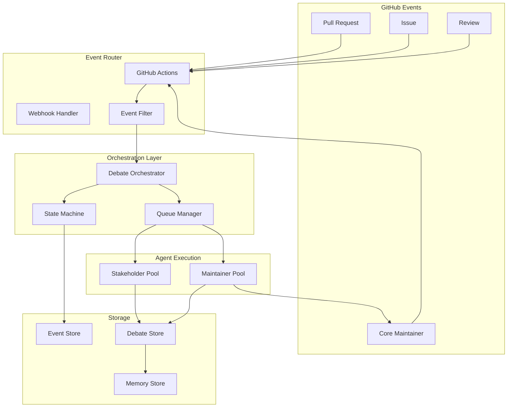

# Event-Driven Workflow Architecture

## Overview

This document describes the event-driven architecture that orchestrates our multi-agent debate system. The system is built on GitHub Actions and webhooks, with Claude Code SDK as the agent runtime.

## Event Architecture



## Event Types and Triggers

### 1. Primary Events

#### Pull Request Events
```yaml
on:
  pull_request:
    types:
      - opened           # New PR created
      - synchronize      # New commits pushed
      - reopened        # Previously closed PR reopened
      - labeled         # Label added (e.g., 'needs-debate')
      - ready_for_review # Draft -> Ready
```

#### Issue Events
```yaml
on:
  issues:
    types:
      - opened          # New issue created
      - labeled         # Label added (e.g., 'architectural-change')
      - assigned        # Assigned to bot for implementation
```

#### Comment Events
```yaml
on:
  issue_comment:
    types: [created]
  pull_request_review_comment:
    types: [created]
```

### 2. Derived Events

These are synthesized from primary events:

- **DebateRequested**: When PR is labeled or `/debate` command issued
- **ConsensusAchieved**: When agents reach agreement
- **EscalationRequired**: When deadlock detected
- **DecisionMade**: When final verdict is reached

## Event Processing Pipeline

### 1. Event Reception
```typescript
interface GitHubEvent {
  type: 'pull_request' | 'issue' | 'comment';
  action: string;
  payload: {
    number: number;
    repository: Repository;
    sender: User;
    // Event-specific fields
  };
  timestamp: string;
}
```

### 2. Event Filtering
```typescript
class EventFilter {
  async shouldProcess(event: GitHubEvent): Promise<boolean> {
    // Check if debate is needed
    if (await this.hasDebateLabel(event)) return true;
    if (await this.hasDebateTrigger(event)) return true;
    if (await this.matchesAutoDebateCriteria(event)) return true;
    return false;
  }
  
  private async matchesAutoDebateCriteria(event: GitHubEvent): Promise<boolean> {
    // Auto-trigger debates for:
    // - Security-related changes
    // - API modifications  
    // - Large changesets (>500 lines)
    // - Multiple subsystem changes
  }
}
```

### 3. Event Enrichment
```typescript
class EventEnricher {
  async enrich(event: GitHubEvent): Promise<EnrichedEvent> {
    return {
      ...event,
      context: {
        files: await this.getChangedFiles(event),
        diff: await this.getDiff(event),
        history: await this.getRecentHistory(event),
        metrics: await this.gatherMetrics(event)
      },
      participants: await this.identifyParticipants(event),
      debateConfig: await this.loadDebateConfig(event)
    };
  }
}
```

## Workflow Orchestration

### 1. Main Debate Workflow
```yaml
name: Agent Debate Orchestration
on:
  pull_request:
    types: [opened, synchronize, labeled]
  workflow_dispatch:
    inputs:
      pr_number:
        description: 'PR number to debate'
        required: true

jobs:
  prepare-debate:
    runs-on: ubuntu-latest
    outputs:
      debate-id: ${{ steps.init.outputs.debate-id }}
      participants: ${{ steps.init.outputs.participants }}
    steps:
      - name: Initialize Debate
        id: init
        uses: ./.github/actions/debate-init
        with:
          event: ${{ toJSON(github.event) }}

  stakeholder-analysis:
    needs: prepare-debate
    runs-on: ubuntu-latest
    strategy:
      matrix:
        stakeholder: ${{ fromJSON(needs.prepare-debate.outputs.participants).stakeholders }}
    steps:
      - name: Run Stakeholder Analysis
        uses: anthropics/claude-code-action@v1
        with:
          anthropic_api_key: ${{ secrets.ANTHROPIC_API_KEY }}
          prompt_file: .github/claude/prompts/stakeholders/${{ matrix.stakeholder }}.md
          context: ${{ needs.prepare-debate.outputs.context }}
          output_format: structured
          
  debate-synthesis:
    needs: stakeholder-analysis
    runs-on: ubuntu-latest
    steps:
      - name: Collect Arguments
        uses: ./.github/actions/collect-arguments
        
      - name: Run Maintainer Deliberation
        uses: anthropics/claude-code-action@v1
        with:
          anthropic_api_key: ${{ secrets.ANTHROPIC_API_KEY }}
          prompt_file: .github/claude/prompts/maintainers/synthesis.md
          
  decision:
    needs: debate-synthesis
    runs-on: ubuntu-latest
    steps:
      - name: Make Decision
        uses: ./.github/actions/make-decision
        with:
          consensus_threshold: 0.65
```

### 2. Event Handler Workflow
```yaml
name: Event Handler
on:
  issue_comment:
    types: [created]

jobs:
  handle-command:
    if: startsWith(github.event.comment.body, '/')
    runs-on: ubuntu-latest
    steps:
      - name: Parse Command
        id: parse
        run: |
          COMMAND=$(echo "${{ github.event.comment.body }}" | awk '{print $1}')
          echo "command=$COMMAND" >> $GITHUB_OUTPUT
          
      - name: Route Command
        uses: ./.github/actions/command-router
        with:
          command: ${{ steps.parse.outputs.command }}
          comment_id: ${{ github.event.comment.id }}
```

## State Management

### 1. Debate State Machine
```typescript
enum DebateState {
  INITIALIZED = 'initialized',
  EVIDENCE_GATHERING = 'evidence_gathering',
  ARGUMENTS_OPEN = 'arguments_open',
  REBUTTALS = 'rebuttals',
  CLARIFICATION = 'clarification',
  FINAL_ARGUMENTS = 'final_arguments',
  SYNTHESIS = 'synthesis',
  DECISION_PENDING = 'decision_pending',
  COMPLETED = 'completed',
  FAILED = 'failed'
}

class DebateStateMachine {
  transitions = {
    [DebateState.INITIALIZED]: [DebateState.EVIDENCE_GATHERING],
    [DebateState.EVIDENCE_GATHERING]: [DebateState.ARGUMENTS_OPEN, DebateState.FAILED],
    [DebateState.ARGUMENTS_OPEN]: [DebateState.REBUTTALS, DebateState.FAILED],
    // ... more transitions
  };
  
  async transition(debateId: string, newState: DebateState): Promise<void> {
    const current = await this.getState(debateId);
    if (!this.isValidTransition(current, newState)) {
      throw new Error(`Invalid transition: ${current} -> ${newState}`);
    }
    
    await this.setState(debateId, newState);
    await this.emitStateChange(debateId, current, newState);
  }
}
```

### 2. Event Sourcing
```typescript
interface DebateEvent {
  id: string;
  debateId: string;
  type: string;
  timestamp: Date;
  actor: string;
  data: any;
}

class EventStore {
  async append(event: DebateEvent): Promise<void> {
    // Store event immutably
    await this.db.events.insert(event);
    
    // Update projections
    await this.updateDebateProjection(event);
    await this.updateAgentProjection(event);
  }
  
  async replay(debateId: string): Promise<DebateState> {
    const events = await this.db.events.find({ debateId });
    return events.reduce((state, event) => 
      this.applyEvent(state, event), 
      initialDebateState
    );
  }
}
```

## Queue Management

### 1. Task Queue
```typescript
interface DebateTask {
  id: string;
  type: 'analyze' | 'argue' | 'synthesize';
  agent: string;
  priority: number;
  payload: any;
  deadline: Date;
}

class QueueManager {
  async enqueue(task: DebateTask): Promise<void> {
    await this.redis.zadd(
      'debate:queue',
      task.priority,
      JSON.stringify(task)
    );
  }
  
  async dequeue(agent: string): Promise<DebateTask | null> {
    const tasks = await this.redis.zrevrange('debate:queue', 0, -1);
    for (const taskStr of tasks) {
      const task = JSON.parse(taskStr);
      if (task.agent === agent) {
        await this.redis.zrem('debate:queue', taskStr);
        return task;
      }
    }
    return null;
  }
}
```

### 2. Concurrency Control
```yaml
concurrency:
  group: debate-${{ github.event.pull_request.number }}
  cancel-in-progress: false  # Don't cancel ongoing debates
```

## Event Patterns

### 1. Fan-Out Pattern
```yaml
# Parallel stakeholder execution
stakeholder-analysis:
  strategy:
    matrix:
      stakeholder: [security, performance, ux, testing]
    max-parallel: 4
```

### 2. Fan-In Pattern
```typescript
class ArgumentCollector {
  async collectArguments(debateId: string): Promise<Arguments[]> {
    const stakeholders = await this.getStakeholders(debateId);
    const promises = stakeholders.map(s => 
      this.getArgument(debateId, s)
    );
    
    return Promise.all(promises);
  }
}
```

### 3. Circuit Breaker Pattern
```typescript
class AgentCircuitBreaker {
  private failures: Map<string, number> = new Map();
  private readonly threshold = 3;
  private readonly timeout = 60000; // 1 minute
  
  async callAgent(agent: string, task: any): Promise<any> {
    if (this.isOpen(agent)) {
      throw new Error(`Circuit breaker open for ${agent}`);
    }
    
    try {
      const result = await this.executeWithTimeout(agent, task);
      this.recordSuccess(agent);
      return result;
    } catch (error) {
      this.recordFailure(agent);
      throw error;
    }
  }
}
```

## Integration Points

### 1. Claude Code SDK Integration
```typescript
import { query } from "@anthropic-ai/claude-code";

class ClaudeAgent {
  async analyze(context: string, prompt: string): Promise<Analysis> {
    const messages = [];
    
    for await (const message of query({
      prompt: `${prompt}\n\nContext:\n${context}`,
      options: {
        maxTurns: 1,
        model: 'claude-opus-4',
        temperature: 0.3
      }
    })) {
      messages.push(message);
    }
    
    return this.parseAnalysis(messages);
  }
}
```

### 2. GitHub API Integration
```typescript
class GitHubIntegration {
  async postComment(pr: number, comment: string): Promise<void> {
    await this.octokit.issues.createComment({
      owner: this.owner,
      repo: this.repo,
      issue_number: pr,
      body: comment
    });
  }
  
  async updatePRStatus(pr: number, status: string): Promise<void> {
    await this.octokit.repos.createCommitStatus({
      owner: this.owner,
      repo: this.repo,
      sha: await this.getPRHeadSha(pr),
      state: status,
      context: 'agent-debate',
      description: 'Multi-agent debate result'
    });
  }
}
```

## Monitoring and Observability

### 1. Event Metrics
```typescript
class EventMetrics {
  async recordEvent(event: GitHubEvent): Promise<void> {
    // OpenTelemetry metrics
    this.meter.createCounter('github_events_total').add(1, {
      type: event.type,
      action: event.action
    });
    
    // Custom metrics
    await this.prometheus.increment('debate_events_total', {
      event_type: event.type
    });
  }
}
```

### 2. Trace Context
```typescript
class TraceContext {
  createSpan(name: string, parent?: Span): Span {
    return this.tracer.startSpan(name, {
      parent,
      attributes: {
        'debate.id': this.debateId,
        'github.pr': this.prNumber,
        'service.name': 'debate-orchestrator'
      }
    });
  }
}
```

## Error Handling

### 1. Retry Strategy
```yaml
retry:
  automatic:
    - maximum_attempts: 3
      initial_interval: 5s
      maximum_interval: 30s
      multiplier: 2
      randomization_factor: 0.1
```

### 2. Fallback Mechanisms
```typescript
class FallbackHandler {
  async handleAgentFailure(agent: string, task: any): Promise<any> {
    // Try backup agent
    const backup = this.getBackupAgent(agent);
    if (backup) {
      return this.callAgent(backup, task);
    }
    
    // Escalate to human
    await this.escalateToHuman(task);
  }
}
```

## Security Considerations

### 1. Event Validation
```typescript
class EventValidator {
  async validate(event: GitHubEvent): Promise<boolean> {
    // Verify webhook signature
    if (!await this.verifySignature(event)) {
      return false;
    }
    
    // Check permissions
    if (!await this.hasPermission(event.sender, event.action)) {
      return false;
    }
    
    // Rate limiting
    if (await this.isRateLimited(event.sender)) {
      return false;
    }
    
    return true;
  }
}
```

### 2. Sandboxing
```yaml
jobs:
  agent-execution:
    runs-on: ubuntu-latest
    container:
      image: anthropic/claude-code-sandbox:latest
      options: >-
        --security-opt seccomp=unconfined
        --cap-drop ALL
        --read-only
        --network none
```

This event-driven architecture ensures reliable, scalable, and secure orchestration of multi-agent debates while maintaining high performance and observability.