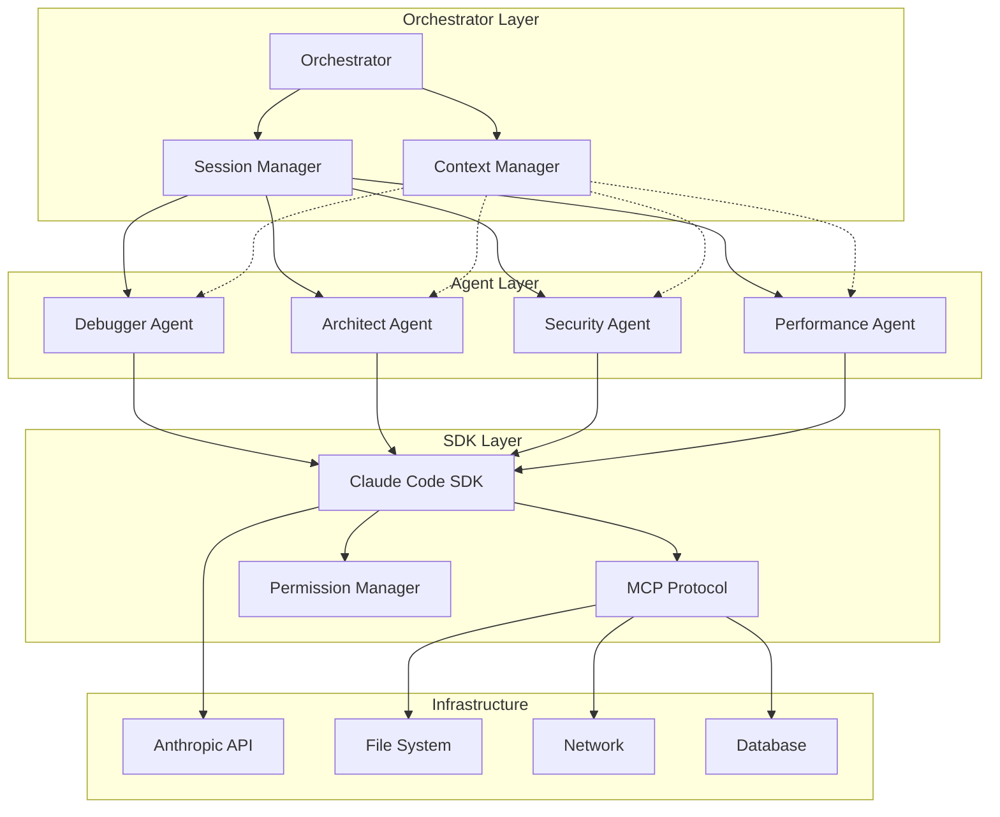
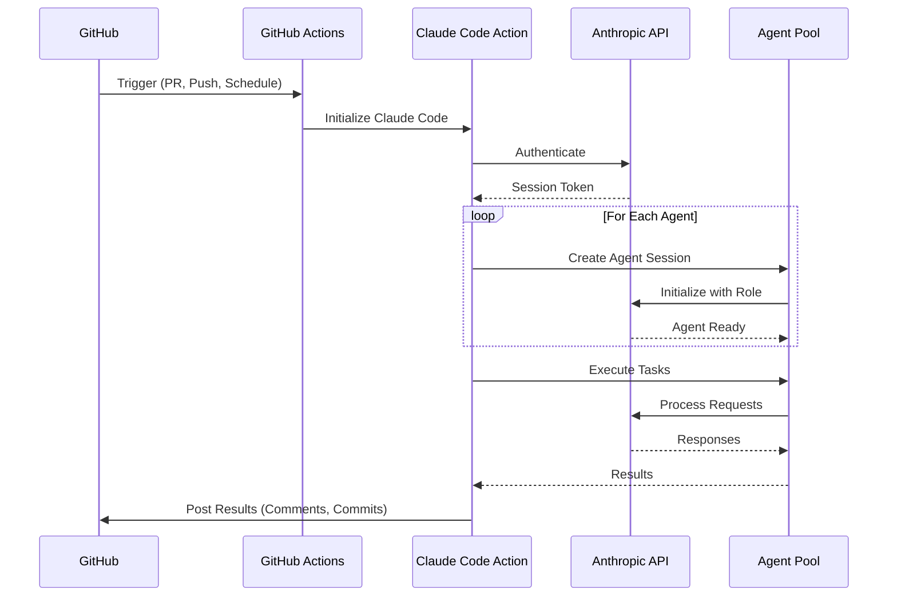

# Claude Code SDK Integration Research

## Table of Contents
1. [SDK Architecture & Capabilities](#sdk-architecture--capabilities)
2. [Multi-Agent Implementation Patterns](#multi-agent-implementation-patterns)
3. [GitHub Actions Integration](#github-actions-integration)
4. [Practical Examples](#practical-examples)
5. [Advanced Features](#advanced-features)

## SDK Architecture & Capabilities

### Core SDK Features

The Claude Code SDK provides a powerful interface for building AI-powered applications with Claude. Key features include:

- **TypeScript and Python Support**: Full API bindings for both languages
- **Session Management**: Persistent conversation contexts across interactions
- **Tool Integration**: Built-in support for file operations, web search, and custom tools
- **MCP Protocol**: Model Context Protocol for extending Claude's capabilities
- **Memory Management**: CLAUDE.md files for persistent context and instructions

### TypeScript API Details

```typescript
import { ClaudeCode } from '@anthropic/claude-code-sdk';

// Initialize the SDK
const claude = new ClaudeCode({
  apiKey: process.env.ANTHROPIC_API_KEY,
  model: 'claude-3-opus-20240229',
  maxTokens: 4096
});

// Create a session
const session = await claude.createSession({
  systemPrompt: "You are a helpful coding assistant",
  tools: ['file_read', 'file_write', 'web_search'],
  mcpServers: ['@modelcontextprotocol/server-filesystem']
});

// Send messages
const response = await session.sendMessage("Help me refactor this code");
```

### Python API Details

```python
from claude_code_sdk import ClaudeCode

# Initialize the SDK
claude = ClaudeCode(
    api_key=os.environ["ANTHROPIC_API_KEY"],
    model="claude-3-opus-20240229",
    max_tokens=4096
)

# Create a session
session = await claude.create_session(
    system_prompt="You are a helpful coding assistant",
    tools=["file_read", "file_write", "web_search"],
    mcp_servers=["@modelcontextprotocol/server-filesystem"]
)

# Send messages
response = await session.send_message("Help me refactor this code")
```

### MCP (Model Context Protocol) Integration

MCP enables Claude to interact with external systems through a standardized protocol:

```json
{
  "mcpServers": {
    "filesystem": {
      "command": "npx",
      "args": ["-y", "@modelcontextprotocol/server-filesystem", "/path/to/workspace"]
    },
    "github": {
      "command": "npx",
      "args": ["-y", "@modelcontextprotocol/server-github"],
      "env": {
        "GITHUB_TOKEN": "${GITHUB_TOKEN}"
      }
    }
  }
}
```

### Memory Management with CLAUDE.md

CLAUDE.md files provide persistent context for Claude sessions:

```markdown
# Project Context

## Architecture
- Frontend: React + TypeScript
- Backend: Node.js + Express
- Database: PostgreSQL

## Coding Standards
- Use ESLint configuration
- Follow team's naming conventions
- Write tests for all new features

## Current Focus
Working on user authentication system
```

## Multi-Agent Implementation Patterns

### Creating Multiple Specialized Agents

```typescript
// Agent factory pattern
class AgentFactory {
  private sdk: ClaudeCode;
  
  constructor(apiKey: string) {
    this.sdk = new ClaudeCode({ apiKey });
  }
  
  async createDebuggerAgent() {
    return await this.sdk.createSession({
      systemPrompt: `You are a debugging specialist. Focus on:
        - Identifying root causes of bugs
        - Suggesting fixes with minimal side effects
        - Writing comprehensive test cases`,
      tools: ['file_read', 'file_write', 'bash'],
      temperature: 0.2 // Lower temperature for precise debugging
    });
  }
  
  async createArchitectAgent() {
    return await this.sdk.createSession({
      systemPrompt: `You are a software architect. Focus on:
        - System design and architecture patterns
        - Scalability and performance considerations
        - Technology selection and trade-offs`,
      tools: ['file_read', 'web_search'],
      temperature: 0.7 // Higher temperature for creative solutions
    });
  }
  
  async createReviewerAgent() {
    return await this.sdk.createSession({
      systemPrompt: `You are a code reviewer. Focus on:
        - Code quality and maintainability
        - Security vulnerabilities
        - Performance optimizations`,
      tools: ['file_read', 'grep'],
      temperature: 0.3
    });
  }
}
```

### Session Management for Different Agent Personas

```typescript
class MultiAgentOrchestrator {
  private agents: Map<string, Session> = new Map();
  private sharedContext: SharedContext;
  
  async initializeAgents() {
    const factory = new AgentFactory(process.env.ANTHROPIC_API_KEY);
    
    // Initialize specialized agents
    this.agents.set('debugger', await factory.createDebuggerAgent());
    this.agents.set('architect', await factory.createArchitectAgent());
    this.agents.set('reviewer', await factory.createReviewerAgent());
    
    // Initialize shared context
    this.sharedContext = new SharedContext();
  }
  
  async runDebate(topic: string) {
    const debuggerView = await this.agents.get('debugger').sendMessage(
      `Analyze this issue: ${topic}`
    );
    
    const architectView = await this.agents.get('architect').sendMessage(
      `Consider this debugging perspective: ${debuggerView}. 
       What's your architectural view?`
    );
    
    const reviewerConclusion = await this.agents.get('reviewer').sendMessage(
      `Given these perspectives:
       Debugger: ${debuggerView}
       Architect: ${architectView}
       Provide your review and recommendation.`
    );
    
    return {
      debugger: debuggerView,
      architect: architectView,
      reviewer: reviewerConclusion
    };
  }
}
```

### Parallel Execution Strategies

```typescript
async function parallelAgentExecution(tasks: Task[]) {
  const agentPool = await createAgentPool(5); // Pool of 5 agents
  
  const results = await Promise.all(
    tasks.map(async (task) => {
      const agent = await agentPool.acquire();
      try {
        const result = await agent.processTask(task);
        return { task, result, success: true };
      } catch (error) {
        return { task, error, success: false };
      } finally {
        agentPool.release(agent);
      }
    })
  );
  
  return results;
}
```

### Context Sharing Between Agents

```typescript
class SharedContext {
  private state: Map<string, any> = new Map();
  private subscribers: Map<string, (update: any) => void> = new Map();
  
  set(key: string, value: any) {
    this.state.set(key, value);
    this.notifySubscribers(key, value);
  }
  
  get(key: string) {
    return this.state.get(key);
  }
  
  subscribe(agentId: string, callback: (update: any) => void) {
    this.subscribers.set(agentId, callback);
  }
  
  private notifySubscribers(key: string, value: any) {
    this.subscribers.forEach(callback => {
      callback({ key, value, timestamp: Date.now() });
    });
  }
}

// Usage in agent communication
class ContextAwareAgent {
  constructor(
    private session: Session,
    private sharedContext: SharedContext,
    private agentId: string
  ) {
    this.sharedContext.subscribe(this.agentId, this.handleContextUpdate.bind(this));
  }
  
  private handleContextUpdate(update: any) {
    // React to context changes from other agents
    if (update.key === 'code_changes') {
      this.reviewChanges(update.value);
    }
  }
  
  async makeDecision(input: string) {
    const context = this.gatherContext();
    const decision = await this.session.sendMessage(
      `Given context: ${JSON.stringify(context)}, ${input}`
    );
    
    // Share decision with other agents
    this.sharedContext.set(`decision_${this.agentId}`, decision);
    return decision;
  }
}
```

## GitHub Actions Integration

### Using Claude Code Action in Workflows

```yaml
name: AI-Powered Code Review
on:
  pull_request:
    types: [opened, synchronize]

jobs:
  ai-review:
    runs-on: ubuntu-latest
    steps:
      - uses: actions/checkout@v4
      
      - name: Claude Code Review
        uses: anthropics/claude-code-action@v1
        with:
          api-key: ${{ secrets.ANTHROPIC_API_KEY }}
          model: claude-3-opus-20240229
          max-tokens: 4096
          system-prompt: |
            You are a code reviewer focusing on:
            - Security vulnerabilities
            - Performance issues
            - Code quality
            - Best practices
          
      - name: Post Review Comments
        uses: actions/github-script@v7
        with:
          script: |
            const review = core.getInput('claude-review');
            await github.rest.pulls.createReview({
              owner: context.repo.owner,
              repo: context.repo.repo,
              pull_number: context.issue.number,
              body: review,
              event: 'COMMENT'
            });
```

### Authentication Patterns

#### API Key Authentication
```yaml
- name: Claude Code with API Key
  uses: anthropics/claude-code-action@v1
  with:
    api-key: ${{ secrets.ANTHROPIC_API_KEY }}
```

#### AWS Bedrock Authentication
```yaml
- name: Claude Code with Bedrock
  uses: anthropics/claude-code-action@v1
  with:
    auth-method: bedrock
    aws-region: us-east-1
    aws-access-key-id: ${{ secrets.AWS_ACCESS_KEY_ID }}
    aws-secret-access-key: ${{ secrets.AWS_SECRET_ACCESS_KEY }}
```

#### Google Vertex AI Authentication
```yaml
- name: Claude Code with Vertex AI
  uses: anthropics/claude-code-action@v1
  with:
    auth-method: vertex
    gcp-project-id: ${{ secrets.GCP_PROJECT_ID }}
    gcp-credentials: ${{ secrets.GCP_CREDENTIALS }}
```

### Trigger Mechanisms and Workflow Orchestration

```yaml
name: Multi-Agent Debate Workflow
on:
  workflow_dispatch:
    inputs:
      debate_topic:
        description: 'Topic for agent debate'
        required: true
      num_rounds:
        description: 'Number of debate rounds'
        default: '3'

jobs:
  orchestrate-debate:
    runs-on: ubuntu-latest
    strategy:
      matrix:
        agent: [optimizer, security, architect]
    
    steps:
      - uses: actions/checkout@v4
      
      - name: Initialize Agent ${{ matrix.agent }}
        id: agent-init
        uses: anthropics/claude-code-action@v1
        with:
          api-key: ${{ secrets.ANTHROPIC_API_KEY }}
          session-id: debate-${{ github.run_id }}-${{ matrix.agent }}
          system-prompt: |
            You are the ${{ matrix.agent }} agent in a technical debate.
            Your role: ${{ matrix.agent == 'optimizer' && 'Focus on performance and efficiency' || matrix.agent == 'security' && 'Focus on security and safety' || 'Focus on architecture and design patterns' }}
      
      - name: Conduct Debate Round
        uses: anthropics/claude-code-action@v1
        with:
          api-key: ${{ secrets.ANTHROPIC_API_KEY }}
          session-id: debate-${{ github.run_id }}-${{ matrix.agent }}
          message: |
            Topic: ${{ github.event.inputs.debate_topic }}
            Previous arguments: ${{ steps.previous-round.outputs.arguments }}
            Provide your perspective.
```

### Cost Optimization with Max Plan

```yaml
name: Optimized AI Workflow
on:
  schedule:
    - cron: '0 2 * * *' # Run at 2 AM daily

jobs:
  batch-analysis:
    runs-on: ubuntu-latest
    steps:
      - name: Batch Process with Rate Limiting
        uses: anthropics/claude-code-action@v1
        with:
          api-key: ${{ secrets.ANTHROPIC_API_KEY }}
          max-requests-per-minute: 10
          retry-strategy: exponential
          max-retries: 3
          batch-mode: true
          tasks: |
            - analyze-security-vulnerabilities
            - review-performance-bottlenecks
            - suggest-refactoring-opportunities
```

## Practical Examples

### Code Snippets for Agent Initialization

```typescript
// Complete agent initialization example
import { ClaudeCode, Session, MCPServer } from '@anthropic/claude-code-sdk';

class SpecializedAgent {
  private session: Session;
  private mcpServers: MCPServer[] = [];
  
  async initialize(role: string, customPrompt: string) {
    const sdk = new ClaudeCode({
      apiKey: process.env.ANTHROPIC_API_KEY,
      model: 'claude-3-opus-20240229'
    });
    
    // Configure MCP servers based on role
    if (role === 'database-expert') {
      this.mcpServers.push({
        name: 'postgres-server',
        command: 'npx',
        args: ['-y', '@modelcontextprotocol/server-postgres'],
        env: { DATABASE_URL: process.env.DATABASE_URL }
      });
    }
    
    // Create session with role-specific configuration
    this.session = await sdk.createSession({
      systemPrompt: customPrompt,
      tools: this.getToolsForRole(role),
      mcpServers: this.mcpServers,
      temperature: this.getTemperatureForRole(role),
      maxTokens: 4096
    });
    
    // Load CLAUDE.md if exists
    await this.loadContextFile(role);
  }
  
  private getToolsForRole(role: string): string[] {
    const toolMap = {
      'debugger': ['file_read', 'file_write', 'bash', 'grep'],
      'architect': ['file_read', 'web_search', 'diagram'],
      'tester': ['file_read', 'file_write', 'bash', 'test_runner'],
      'database-expert': ['sql_query', 'schema_analyzer']
    };
    return toolMap[role] || ['file_read', 'file_write'];
  }
  
  private getTemperatureForRole(role: string): number {
    const tempMap = {
      'debugger': 0.2,      // Precise, deterministic
      'architect': 0.7,     // Creative, exploratory
      'tester': 0.3,        // Systematic, thorough
      'reviewer': 0.4       // Balanced
    };
    return tempMap[role] || 0.5;
  }
}
```

### Debate Orchestration Using SDK

```typescript
class DebateOrchestrator {
  private agents: Map<string, SpecializedAgent> = new Map();
  private debateHistory: DebateEntry[] = [];
  
  async setupDebate(topic: string, participants: string[]) {
    // Initialize agents for debate
    for (const participant of participants) {
      const agent = new SpecializedAgent();
      await agent.initialize(participant, 
        `You are participating in a technical debate as the ${participant} expert.
         Be constructive but defend your position with evidence.`);
      this.agents.set(participant, agent);
    }
    
    // Initialize debate context
    this.debateHistory.push({
      round: 0,
      topic,
      participants,
      timestamp: new Date()
    });
  }
  
  async conductRound(roundNumber: number) {
    const roundResponses = new Map<string, string>();
    
    // Sequential responses with context
    for (const [role, agent] of this.agents) {
      const previousResponses = Array.from(roundResponses.entries())
        .map(([r, response]) => `${r}: ${response}`)
        .join('\n\n');
      
      const prompt = `
        Round ${roundNumber} of debate on: ${this.debateHistory[0].topic}
        
        Previous responses this round:
        ${previousResponses || 'You are the first to respond.'}
        
        Provide your perspective as the ${role} expert.
      `;
      
      const response = await agent.sendMessage(prompt);
      roundResponses.set(role, response);
      
      // Allow for extended thinking on complex topics
      if (this.requiresDeepThought(response)) {
        const extendedResponse = await agent.think({
          prompt: "Elaborate on the most complex aspect of your argument",
          thinkingTime: 30000 // 30 seconds
        });
        roundResponses.set(role, response + '\n\n' + extendedResponse);
      }
    }
    
    this.debateHistory.push({
      round: roundNumber,
      responses: roundResponses,
      timestamp: new Date()
    });
    
    return roundResponses;
  }
  
  async synthesizeConclusion() {
    // Create a synthesizer agent
    const synthesizer = new SpecializedAgent();
    await synthesizer.initialize('synthesizer', 
      'You synthesize multiple viewpoints into actionable conclusions.');
    
    const allResponses = this.debateHistory
      .filter(entry => entry.responses)
      .map(entry => {
        const responses = Array.from(entry.responses.entries())
          .map(([role, response]) => `${role}: ${response}`)
          .join('\n\n');
        return `Round ${entry.round}:\n${responses}`;
      })
      .join('\n\n---\n\n');
    
    return await synthesizer.sendMessage(`
      Synthesize the following debate into clear conclusions and action items:
      
      ${allResponses}
    `);
  }
}
```

### MCP Server Setup for Agent Tools

```typescript
// Custom MCP server for agent-specific tools
import { MCPServer, Tool, Resource } from '@modelcontextprotocol/sdk';

class AgentToolServer extends MCPServer {
  constructor(private agentRole: string) {
    super({
      name: `agent-tools-${agentRole}`,
      version: '1.0.0'
    });
    
    this.registerTools();
    this.registerResources();
  }
  
  private registerTools() {
    // Role-specific tools
    if (this.agentRole === 'performance-optimizer') {
      this.registerTool({
        name: 'profile_code',
        description: 'Profile code performance',
        inputSchema: {
          type: 'object',
          properties: {
            filePath: { type: 'string' },
            functionName: { type: 'string' }
          }
        },
        handler: async (params) => {
          // Implementation for profiling
          return { executionTime: 142, memoryUsage: '23MB' };
        }
      });
    }
    
    if (this.agentRole === 'security-auditor') {
      this.registerTool({
        name: 'scan_vulnerabilities',
        description: 'Scan code for security vulnerabilities',
        inputSchema: {
          type: 'object',
          properties: {
            directory: { type: 'string' },
            scanType: { 
              type: 'string',
              enum: ['full', 'quick', 'dependencies']
            }
          }
        },
        handler: async (params) => {
          // Implementation for security scanning
          return { 
            vulnerabilities: [],
            recommendations: ['Enable CSP headers', 'Update dependencies']
          };
        }
      });
    }
  }
  
  private registerResources() {
    // Agent-specific resources
    this.registerResource({
      name: `${this.agentRole}-guidelines`,
      description: `Guidelines for ${this.agentRole}`,
      mimeType: 'text/markdown',
      handler: async () => {
        return this.getGuidelinesForRole();
      }
    });
  }
}

// Usage in agent initialization
const performanceServer = new AgentToolServer('performance-optimizer');
await performanceServer.start();

const agent = await claude.createSession({
  mcpServers: [{
    url: performanceServer.url,
    transport: 'stdio'
  }]
});
```

### CLAUDE.md Templates for Different Agent Roles

#### Debugger Agent CLAUDE.md
```markdown
# Debugger Agent Context

## Role
You are a specialized debugging agent focused on identifying and fixing software bugs.

## Methodology
1. **Reproduce**: Always attempt to reproduce the issue first
2. **Isolate**: Narrow down the problem to specific components
3. **Analyze**: Use systematic debugging techniques
4. **Fix**: Propose minimal, targeted fixes
5. **Verify**: Ensure the fix doesn't introduce new issues

## Tools and Techniques
- Print debugging with strategic log placement
- Interactive debuggers (gdb, lldb, Chrome DevTools)
- Memory profilers for memory-related issues
- Static analysis tools

## Common Patterns to Check
- Off-by-one errors
- Null/undefined references
- Race conditions
- Memory leaks
- Infinite loops
- Type mismatches

## Response Format
When debugging, always provide:
1. Root cause analysis
2. Step-by-step reproduction
3. Proposed fix with explanation
4. Test cases to prevent regression
```

#### Architect Agent CLAUDE.md
```markdown
# Software Architect Agent Context

## Role
You are a software architecture specialist focused on system design and high-level technical decisions.

## Design Principles
- **SOLID**: Single Responsibility, Open/Closed, Liskov Substitution, Interface Segregation, Dependency Inversion
- **DRY**: Don't Repeat Yourself
- **KISS**: Keep It Simple, Stupid
- **YAGNI**: You Aren't Gonna Need It

## Architecture Patterns
- Microservices vs Monolith
- Event-driven architecture
- Domain-driven design
- Hexagonal architecture
- CQRS and Event Sourcing

## Evaluation Criteria
1. Scalability
2. Maintainability
3. Performance
4. Security
5. Cost-effectiveness
6. Team expertise

## Deliverables
- Architecture diagrams (C4 model)
- Technology selection matrices
- Risk assessments
- Migration strategies
```

## Advanced Features

### Extended Thinking for Complex Decisions

```typescript
class ThinkingAgent {
  private session: Session;
  
  async complexDecision(problem: string, constraints: string[]) {
    // Enable extended thinking mode
    const thoughtProcess = await this.session.think({
      prompt: `
        Problem: ${problem}
        Constraints: ${constraints.join(', ')}
        
        Think through this systematically:
        1. What are all possible solutions?
        2. What are the trade-offs of each?
        3. Which constraints are hard vs soft?
        4. What are the long-term implications?
      `,
      thinkingTime: 60000, // 1 minute of thinking
      returnThoughts: true // Get the thinking process
    });
    
    // Analyze the thinking process
    const decision = await this.session.sendMessage(`
      Based on your thinking process:
      ${thoughtProcess.thoughts}
      
      Provide your final recommendation with rationale.
    `);
    
    return {
      thoughts: thoughtProcess.thoughts,
      decision: decision,
      confidence: this.assessConfidence(thoughtProcess)
    };
  }
  
  private assessConfidence(thoughtProcess: any): number {
    // Analyze thought process for confidence indicators
    const uncertaintyMarkers = ['might', 'perhaps', 'unclear', 'depends'];
    const certaintyMarkers = ['definitely', 'clearly', 'certain', 'obvious'];
    
    // Simple confidence scoring (0-1)
    let score = 0.5;
    thoughtProcess.thoughts.split(' ').forEach(word => {
      if (uncertaintyMarkers.includes(word.toLowerCase())) score -= 0.05;
      if (certaintyMarkers.includes(word.toLowerCase())) score += 0.05;
    });
    
    return Math.max(0, Math.min(1, score));
  }
}
```

### Resume Functionality for Long Debates

```typescript
class ResumableDebate {
  private stateFile: string;
  private checkpointInterval: number = 5; // rounds
  
  constructor(debateId: string) {
    this.stateFile = `debates/${debateId}.json`;
  }
  
  async saveCheckpoint(state: DebateState) {
    const checkpoint = {
      debateId: state.id,
      round: state.currentRound,
      participants: Array.from(state.participants.keys()),
      history: state.history,
      timestamp: new Date().toISOString()
    };
    
    await fs.writeFile(this.stateFile, JSON.stringify(checkpoint, null, 2));
  }
  
  async resume(): Promise<DebateState | null> {
    try {
      const data = await fs.readFile(this.stateFile, 'utf-8');
      const checkpoint = JSON.parse(data);
      
      // Recreate agents with saved state
      const agents = new Map();
      for (const participant of checkpoint.participants) {
        const agent = await this.recreateAgent(participant, checkpoint.history);
        agents.set(participant, agent);
      }
      
      return {
        id: checkpoint.debateId,
        currentRound: checkpoint.round,
        participants: agents,
        history: checkpoint.history
      };
    } catch (error) {
      return null; // No checkpoint found
    }
  }
  
  private async recreateAgent(role: string, history: any[]) {
    const agent = new SpecializedAgent();
    await agent.initialize(role, `Resume as ${role} expert`);
    
    // Replay relevant history to restore context
    const relevantHistory = history
      .filter(entry => entry.responses && entry.responses[role])
      .map(entry => ({
        round: entry.round,
        response: entry.responses[role]
      }));
    
    if (relevantHistory.length > 0) {
      await agent.sendMessage(`
        You are resuming a debate. Here's your previous contributions:
        ${JSON.stringify(relevantHistory, null, 2)}
        
        Acknowledge and prepare to continue.
      `);
    }
    
    return agent;
  }
}
```

### Custom MCP Servers for Agent-Specific Tools

```typescript
// Domain-specific MCP server example
class DatabaseExpertMCPServer extends MCPServer {
  private dbConnection: DatabaseConnection;
  
  constructor() {
    super({
      name: 'database-expert-tools',
      version: '1.0.0',
      description: 'Specialized tools for database analysis and optimization'
    });
    
    this.initializeTools();
  }
  
  private initializeTools() {
    // Query analyzer tool
    this.registerTool({
      name: 'analyze_query',
      description: 'Analyze SQL query performance',
      inputSchema: {
        type: 'object',
        properties: {
          query: { type: 'string' },
          database: { type: 'string' }
        },
        required: ['query']
      },
      handler: async ({ query, database }) => {
        const plan = await this.dbConnection.explainQuery(query);
        const suggestions = this.analyzeQueryPlan(plan);
        
        return {
          executionPlan: plan,
          estimatedCost: plan.totalCost,
          suggestions: suggestions,
          indexes: this.suggestIndexes(plan)
        };
      }
    });
    
    // Schema analyzer tool
    this.registerTool({
      name: 'analyze_schema',
      description: 'Analyze database schema for optimization opportunities',
      inputSchema: {
        type: 'object',
        properties: {
          schema: { type: 'string' }
        }
      },
      handler: async ({ schema }) => {
        const analysis = await this.analyzeSchema(schema);
        return {
          normalizationIssues: analysis.normalization,
          indexingOpportunities: analysis.indexing,
          performanceRisks: analysis.risks
        };
      }
    });
    
    // Migration generator tool
    this.registerTool({
      name: 'generate_migration',
      description: 'Generate database migration scripts',
      inputSchema: {
        type: 'object',
        properties: {
          fromSchema: { type: 'string' },
          toSchema: { type: 'string' },
          strategy: { 
            type: 'string',
            enum: ['safe', 'fast', 'zero-downtime']
          }
        }
      },
      handler: async ({ fromSchema, toSchema, strategy }) => {
        const migration = await this.generateMigration(
          fromSchema, 
          toSchema, 
          strategy
        );
        
        return {
          upScript: migration.up,
          downScript: migration.down,
          estimatedDuration: migration.duration,
          risks: migration.risks
        };
      }
    });
  }
}
```

### Permission Management for Different Agent Capabilities

```typescript
interface AgentPermissions {
  canReadFiles: boolean;
  canWriteFiles: boolean;
  canExecuteCommands: boolean;
  canAccessNetwork: boolean;
  canAccessDatabase: boolean;
  filePathRestrictions?: string[];
  commandWhitelist?: string[];
  networkDomainWhitelist?: string[];
}

class PermissionManager {
  private permissions: Map<string, AgentPermissions> = new Map();
  
  constructor() {
    // Define default permission sets
    this.definePermissionProfiles();
  }
  
  private definePermissionProfiles() {
    // Read-only analyst
    this.permissions.set('analyst', {
      canReadFiles: true,
      canWriteFiles: false,
      canExecuteCommands: false,
      canAccessNetwork: true,
      canAccessDatabase: true,
      networkDomainWhitelist: ['api.github.com', 'docs.python.org']
    });
    
    // Developer agent
    this.permissions.set('developer', {
      canReadFiles: true,
      canWriteFiles: true,
      canExecuteCommands: true,
      canAccessNetwork: true,
      canAccessDatabase: true,
      commandWhitelist: ['npm', 'yarn', 'git', 'python', 'node'],
      filePathRestrictions: ['/home/project/', '/tmp/']
    });
    
    // Production deployer
    this.permissions.set('deployer', {
      canReadFiles: true,
      canWriteFiles: false,
      canExecuteCommands: true,
      canAccessNetwork: true,
      canAccessDatabase: false,
      commandWhitelist: ['docker', 'kubectl', 'helm'],
      networkDomainWhitelist: ['*.amazonaws.com', '*.googleapis.com']
    });
  }
  
  async createRestrictedSession(
    role: string, 
    permissions: AgentPermissions
  ): Promise<Session> {
    const sdk = new ClaudeCode({
      apiKey: process.env.ANTHROPIC_API_KEY,
      model: 'claude-3-opus-20240229'
    });
    
    // Create session with permission-aware tools
    const tools = this.getPermittedTools(permissions);
    const session = await sdk.createSession({
      systemPrompt: this.buildPermissionAwarePrompt(role, permissions),
      tools: tools,
      // Custom middleware to enforce permissions
      middleware: [
        this.createPermissionMiddleware(permissions)
      ]
    });
    
    return session;
  }
  
  private getPermittedTools(permissions: AgentPermissions): string[] {
    const tools = [];
    
    if (permissions.canReadFiles) tools.push('file_read');
    if (permissions.canWriteFiles) tools.push('file_write');
    if (permissions.canExecuteCommands) tools.push('bash');
    if (permissions.canAccessNetwork) tools.push('web_search', 'web_fetch');
    if (permissions.canAccessDatabase) tools.push('sql_query');
    
    return tools;
  }
  
  private createPermissionMiddleware(permissions: AgentPermissions) {
    return async (request: any, next: Function) => {
      // Validate file operations
      if (request.tool === 'file_read' || request.tool === 'file_write') {
        const filePath = request.params.file_path;
        if (permissions.filePathRestrictions) {
          const allowed = permissions.filePathRestrictions.some(
            restriction => filePath.startsWith(restriction)
          );
          if (!allowed) {
            throw new Error(`Access denied: ${filePath} is outside allowed paths`);
          }
        }
      }
      
      // Validate command execution
      if (request.tool === 'bash') {
        const command = request.params.command.split(' ')[0];
        if (permissions.commandWhitelist && 
            !permissions.commandWhitelist.includes(command)) {
          throw new Error(`Command not allowed: ${command}`);
        }
      }
      
      // Validate network access
      if (request.tool === 'web_fetch') {
        const url = new URL(request.params.url);
        if (permissions.networkDomainWhitelist) {
          const allowed = permissions.networkDomainWhitelist.some(
            domain => {
              if (domain.startsWith('*')) {
                return url.hostname.endsWith(domain.slice(1));
              }
              return url.hostname === domain;
            }
          );
          if (!allowed) {
            throw new Error(`Network access denied: ${url.hostname}`);
          }
        }
      }
      
      return next(request);
    };
  }
}

// Usage example
async function createSecureMultiAgentSystem() {
  const permManager = new PermissionManager();
  
  // Create agents with different permission levels
  const analyst = await permManager.createRestrictedSession(
    'analyst',
    permManager.permissions.get('analyst')
  );
  
  const developer = await permManager.createRestrictedSession(
    'developer',
    permManager.permissions.get('developer')
  );
  
  const deployer = await permManager.createRestrictedSession(
    'deployer',
    permManager.permissions.get('deployer')
  );
  
  // Orchestrate work with permission boundaries
  const analysisResult = await analyst.sendMessage(
    "Analyze the codebase for security vulnerabilities"
  );
  
  const fixResult = await developer.sendMessage(
    `Fix these vulnerabilities: ${analysisResult}`
  );
  
  const deployResult = await deployer.sendMessage(
    "Deploy the fixed version to staging"
  );
  
  return { analysisResult, fixResult, deployResult };
}
```

## Architecture Diagrams

### Multi-Agent System Architecture



### GitHub Actions Integration Flow



## Best Practices and Recommendations

1. **Agent Specialization**: Keep agents focused on specific domains for better results
2. **Context Management**: Use CLAUDE.md files to maintain consistent context
3. **Permission Boundaries**: Implement strict permission controls for production agents
4. **Cost Optimization**: Batch operations and use appropriate models for each task
5. **Error Handling**: Implement comprehensive error handling and retry mechanisms
6. **Monitoring**: Track agent performance and decision quality
7. **Testing**: Create test suites for agent behaviors and interactions

## Conclusion

The Claude Code SDK provides a powerful foundation for building sophisticated multi-agent systems. By leveraging its features for session management, MCP integration, and flexible tool configuration, developers can create AI-powered applications that handle complex tasks through specialized agent collaboration. The combination of GitHub Actions integration and advanced features like extended thinking and permission management enables production-ready deployments with proper governance and control.