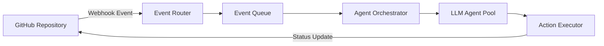
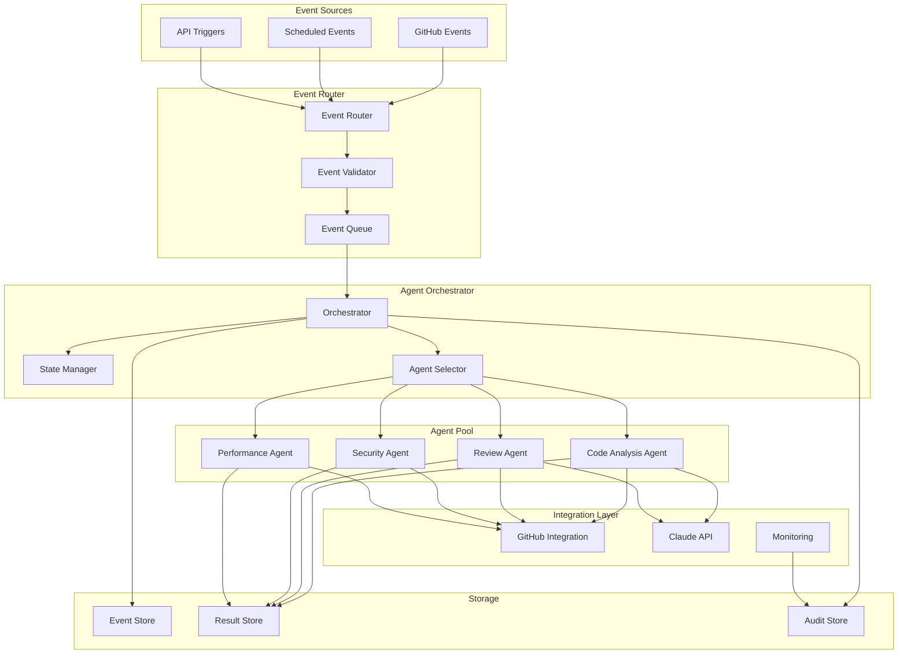

# Event-Driven CI/CD Architecture for LLM Agents

## Table of Contents

1. [Introduction](#introduction)
2. [GitHub Actions Event Model and Webhook Systems](#github-actions-event-model-and-webhook-systems)
3. [Event-Driven Patterns for Agent Workflows](#event-driven-patterns-for-agent-workflows)
4. [Orchestration Patterns for Multi-Stage Pipelines](#orchestration-patterns-for-multi-stage-pipelines)
5. [Fan-out/Fan-in Patterns for Parallel Execution](#fan-outfan-in-patterns-for-parallel-execution)
6. [Event Sourcing and Audit Trails](#event-sourcing-and-audit-trails)
7. [Integration Patterns](#integration-patterns)
8. [Best Practices](#best-practices)
9. [Architecture Examples](#architecture-examples)

## Introduction

Event-driven architectures provide a scalable and flexible foundation for CI/CD systems that leverage LLM agents. This document explores key patterns and best practices for building robust, event-driven CI/CD pipelines that integrate LLM capabilities.

## GitHub Actions Event Model and Webhook Systems

### GitHub Actions Event Types

GitHub Actions supports a comprehensive event catalog that can trigger workflows:

```yaml
# Example: Multi-event workflow trigger
on:
  push:
    branches: [ main, develop ]
  pull_request:
    types: [ opened, synchronize, reopened ]
  issue_comment:
    types: [ created ]
  workflow_dispatch:
    inputs:
      agent_mode:
        description: 'Agent execution mode'
        required: true
        type: choice
        options:
          - review
          - fix
          - refactor
```

### Webhook Architecture

GitHub webhooks enable real-time event propagation to external systems:



### Key Event Properties for LLM Agents

```json
{
  "event_type": "pull_request",
  "action": "opened",
  "repository": {
    "full_name": "org/repo",
    "default_branch": "main"
  },
  "pull_request": {
    "number": 123,
    "head": {
      "sha": "abc123",
      "ref": "feature-branch"
    },
    "base": {
      "sha": "def456",
      "ref": "main"
    }
  },
  "sender": {
    "login": "developer",
    "type": "User"
  }
}
```

## Event-Driven Patterns for Agent Workflows

### 1. Command Pattern for Agent Invocation

Use structured commands in PR comments or commit messages:

```yaml
# .github/workflows/agent-command.yml
on:
  issue_comment:
    types: [created]

jobs:
  parse-command:
    if: contains(github.event.comment.body, '/agent')
    runs-on: ubuntu-latest
    steps:
      - name: Parse Agent Command
        id: parse
        run: |
          COMMAND=$(echo "${{ github.event.comment.body }}" | grep -oP '/agent \K\w+')
          echo "command=$COMMAND" >> $GITHUB_OUTPUT
      
      - name: Dispatch to Agent
        uses: actions/github-script@v6
        with:
          script: |
            await github.rest.actions.createWorkflowDispatch({
              owner: context.repo.owner,
              repo: context.repo.repo,
              workflow_id: 'agent-executor.yml',
              ref: 'main',
              inputs: {
                command: '${{ steps.parse.outputs.command }}',
                context: JSON.stringify(context.payload)
              }
            });
```

### 2. Event Filtering and Routing

Implement smart routing based on event characteristics:

```python
# event_router.py
class EventRouter:
    def __init__(self):
        self.routes = {
            'code_review': self._route_to_review_agent,
            'security_scan': self._route_to_security_agent,
            'documentation': self._route_to_doc_agent,
            'performance': self._route_to_perf_agent
        }
    
    def route_event(self, event):
        # Analyze event to determine routing
        if event['type'] == 'pull_request':
            files_changed = self._get_changed_files(event)
            
            if any(f.endswith('.md') for f in files_changed):
                return self.routes['documentation']
            elif any(f.endswith('.py') for f in files_changed):
                return self.routes['code_review']
            elif 'security' in event.get('labels', []):
                return self.routes['security_scan']
        
        return self.routes['code_review']  # default
```

### 3. State Machine Pattern

Define agent workflow states:

```python
from enum import Enum
from dataclasses import dataclass
from typing import Optional

class AgentState(Enum):
    IDLE = "idle"
    ANALYZING = "analyzing"
    GENERATING = "generating"
    VALIDATING = "validating"
    APPLYING = "applying"
    COMPLETED = "completed"
    FAILED = "failed"

@dataclass
class AgentWorkflow:
    id: str
    state: AgentState
    context: dict
    error: Optional[str] = None
    
    def transition(self, new_state: AgentState):
        valid_transitions = {
            AgentState.IDLE: [AgentState.ANALYZING],
            AgentState.ANALYZING: [AgentState.GENERATING, AgentState.FAILED],
            AgentState.GENERATING: [AgentState.VALIDATING, AgentState.FAILED],
            AgentState.VALIDATING: [AgentState.APPLYING, AgentState.GENERATING, AgentState.FAILED],
            AgentState.APPLYING: [AgentState.COMPLETED, AgentState.FAILED]
        }
        
        if new_state in valid_transitions.get(self.state, []):
            self.state = new_state
            self._emit_state_change_event()
        else:
            raise ValueError(f"Invalid transition from {self.state} to {new_state}")
```

## Orchestration Patterns for Multi-Stage Pipelines

### 1. Sequential Pipeline Pattern

```yaml
# Sequential agent pipeline
name: Sequential Agent Pipeline

on:
  pull_request:
    types: [opened, synchronize]

jobs:
  analyze:
    runs-on: ubuntu-latest
    outputs:
      analysis: ${{ steps.analyze.outputs.result }}
    steps:
      - name: Code Analysis Agent
        id: analyze
        run: |
          # Invoke analysis agent
          RESULT=$(claude-code analyze --context "${{ toJSON(github.event) }}")
          echo "result=$RESULT" >> $GITHUB_OUTPUT

  review:
    needs: analyze
    runs-on: ubuntu-latest
    steps:
      - name: Code Review Agent
        run: |
          # Use analysis results
          claude-code review --analysis "${{ needs.analyze.outputs.analysis }}"

  suggest:
    needs: review
    runs-on: ubuntu-latest
    steps:
      - name: Suggestion Agent
        run: |
          claude-code suggest --pr ${{ github.event.pull_request.number }}
```

### 2. Conditional Pipeline Pattern

```python
# conditional_orchestrator.py
class ConditionalOrchestrator:
    def __init__(self):
        self.conditions = {
            'needs_security_review': lambda ctx: 'security' in ctx.get('labels', []),
            'needs_performance_check': lambda ctx: ctx.get('changed_files', 0) > 50,
            'needs_documentation': lambda ctx: any(
                f.endswith('.api') for f in ctx.get('files', [])
            )
        }
    
    async def orchestrate(self, event_context):
        pipeline = []
        
        # Always run base analysis
        pipeline.append(self.run_base_analysis(event_context))
        
        # Conditionally add stages
        for condition_name, condition_func in self.conditions.items():
            if condition_func(event_context):
                pipeline.append(self.get_stage_for_condition(condition_name))
        
        # Execute pipeline
        results = []
        for stage in pipeline:
            result = await stage.execute(event_context)
            results.append(result)
            event_context['previous_results'] = results
        
        return results
```

### 3. Dynamic Pipeline Generation

```python
# dynamic_pipeline.py
class DynamicPipelineBuilder:
    def build_pipeline(self, event):
        pipeline_config = {
            'stages': [],
            'dependencies': {}
        }
        
        # Analyze event to determine required stages
        if event['type'] == 'pull_request':
            # Add PR-specific stages
            pipeline_config['stages'].extend([
                'lint_check',
                'unit_tests',
                'code_review_agent'
            ])
            
            if self._has_api_changes(event):
                pipeline_config['stages'].append('api_compatibility_agent')
                pipeline_config['dependencies']['api_compatibility_agent'] = ['code_review_agent']
            
            if self._has_database_changes(event):
                pipeline_config['stages'].append('migration_review_agent')
                pipeline_config['dependencies']['migration_review_agent'] = ['lint_check']
        
        return self._create_dag_from_config(pipeline_config)
```

## Fan-out/Fan-in Patterns for Parallel Execution

### 1. File-Based Fan-out

```python
# fan_out_processor.py
import asyncio
from concurrent.futures import ThreadPoolExecutor

class FanOutProcessor:
    def __init__(self, max_workers=5):
        self.executor = ThreadPoolExecutor(max_workers=max_workers)
    
    async def process_files_parallel(self, files, agent_func):
        """Fan out file processing to multiple agents"""
        tasks = []
        
        for file in files:
            # Create a task for each file
            task = asyncio.create_task(
                self._process_file_with_agent(file, agent_func)
            )
            tasks.append(task)
        
        # Fan-in: Wait for all tasks and collect results
        results = await asyncio.gather(*tasks, return_exceptions=True)
        
        return self._aggregate_results(results)
    
    async def _process_file_with_agent(self, file, agent_func):
        return await asyncio.get_event_loop().run_in_executor(
            self.executor, agent_func, file
        )
    
    def _aggregate_results(self, results):
        aggregated = {
            'processed': len(results),
            'successful': sum(1 for r in results if not isinstance(r, Exception)),
            'failed': sum(1 for r in results if isinstance(r, Exception)),
            'results': results
        }
        return aggregated
```

### 2. Topic-Based Fan-out

```yaml
# GitHub Actions Matrix Strategy for Fan-out
name: Parallel Agent Execution

on:
  workflow_dispatch:
    inputs:
      targets:
        description: 'Targets to process'
        required: true

jobs:
  prepare:
    runs-on: ubuntu-latest
    outputs:
      matrix: ${{ steps.set-matrix.outputs.matrix }}
    steps:
      - id: set-matrix
        run: |
          # Parse targets and create matrix
          TARGETS='["security", "performance", "documentation", "testing"]'
          echo "matrix={\"target\":$TARGETS}" >> $GITHUB_OUTPUT

  process:
    needs: prepare
    runs-on: ubuntu-latest
    strategy:
      matrix: ${{fromJson(needs.prepare.outputs.matrix)}}
      max-parallel: 4
    steps:
      - name: Process with Agent
        run: |
          claude-code process --target ${{ matrix.target }}
      
      - name: Upload Results
        uses: actions/upload-artifact@v3
        with:
          name: results-${{ matrix.target }}
          path: results/

  aggregate:
    needs: process
    runs-on: ubuntu-latest
    steps:
      - name: Download All Results
        uses: actions/download-artifact@v3
        with:
          path: all-results/
      
      - name: Aggregate Results
        run: |
          claude-code aggregate --input all-results/ --output final-report.md
```

### 3. Event-Stream Fan-out

```python
# event_stream_fanout.py
import asyncio
from typing import List, Callable
import aioredis

class EventStreamFanOut:
    def __init__(self, redis_url: str):
        self.redis_url = redis_url
        self.subscribers = {}
    
    async def publish_event(self, channel: str, event: dict):
        redis = await aioredis.create_redis_pool(self.redis_url)
        try:
            await redis.publish(channel, json.dumps(event))
        finally:
            redis.close()
            await redis.wait_closed()
    
    async def fan_out_to_agents(self, event: dict, agent_configs: List[dict]):
        """Fan out event to multiple agents based on configuration"""
        tasks = []
        
        for config in agent_configs:
            if self._should_process(event, config):
                task = asyncio.create_task(
                    self._invoke_agent(event, config)
                )
                tasks.append(task)
        
        # Wait for all agents to complete
        results = await asyncio.gather(*tasks, return_exceptions=True)
        
        # Publish aggregated results
        await self.publish_event('agent-results', {
            'original_event': event,
            'results': results,
            'timestamp': datetime.utcnow().isoformat()
        })
    
    def _should_process(self, event: dict, config: dict) -> bool:
        """Determine if agent should process this event"""
        filters = config.get('event_filters', {})
        
        for key, value in filters.items():
            if event.get(key) != value:
                return False
        
        return True
```

## Event Sourcing and Audit Trails

### 1. Event Store Implementation

```python
# event_store.py
from datetime import datetime
from typing import List, Optional
import json
import hashlib

class AgentEventStore:
    def __init__(self, storage_backend):
        self.storage = storage_backend
    
    def append_event(self, event_type: str, data: dict, metadata: dict = None):
        event = {
            'id': self._generate_event_id(data),
            'type': event_type,
            'timestamp': datetime.utcnow().isoformat(),
            'data': data,
            'metadata': metadata or {},
            'version': 1
        }
        
        # Store event
        self.storage.append(event)
        
        # Emit for real-time processing
        self._emit_event(event)
        
        return event['id']
    
    def get_event_stream(self, 
                        aggregate_id: str, 
                        from_version: int = 0) -> List[dict]:
        """Get all events for an aggregate from a specific version"""
        return self.storage.query(
            aggregate_id=aggregate_id,
            from_version=from_version
        )
    
    def _generate_event_id(self, data: dict) -> str:
        content = json.dumps(data, sort_keys=True)
        return hashlib.sha256(content.encode()).hexdigest()[:16]
```

### 2. Agent Decision Audit Trail

```python
# audit_trail.py
@dataclass
class AgentDecision:
    agent_id: str
    decision_type: str
    input_context: dict
    output: dict
    reasoning: str
    confidence: float
    timestamp: datetime
    
class AgentAuditTrail:
    def __init__(self, event_store: AgentEventStore):
        self.event_store = event_store
    
    def record_decision(self, decision: AgentDecision):
        """Record an agent's decision with full context"""
        self.event_store.append_event(
            event_type='agent_decision',
            data={
                'agent_id': decision.agent_id,
                'decision_type': decision.decision_type,
                'input_context': decision.input_context,
                'output': decision.output,
                'reasoning': decision.reasoning,
                'confidence': decision.confidence
            },
            metadata={
                'timestamp': decision.timestamp.isoformat(),
                'version': '1.0'
            }
        )
    
    def get_decision_history(self, 
                           agent_id: Optional[str] = None,
                           decision_type: Optional[str] = None,
                           from_date: Optional[datetime] = None) -> List[AgentDecision]:
        """Query historical decisions with filters"""
        events = self.event_store.query(
            event_type='agent_decision',
            filters={
                'agent_id': agent_id,
                'decision_type': decision_type
            },
            from_date=from_date
        )
        
        return [self._event_to_decision(e) for e in events]
```

### 3. Compliance and Reproducibility

```yaml
# audit-compliant-workflow.yml
name: Audit-Compliant Agent Workflow

on:
  pull_request:
    types: [opened, synchronize]

jobs:
  agent-review:
    runs-on: ubuntu-latest
    steps:
      - name: Checkout
        uses: actions/checkout@v3
      
      - name: Generate Execution Context
        id: context
        run: |
          CONTEXT=$(cat <<EOF
          {
            "workflow_run_id": "${{ github.run_id }}",
            "workflow_run_number": "${{ github.run_number }}",
            "triggered_by": "${{ github.actor }}",
            "event_type": "${{ github.event_name }}",
            "repository": "${{ github.repository }}",
            "sha": "${{ github.sha }}",
            "ref": "${{ github.ref }}"
          }
          EOF
          )
          echo "context=$CONTEXT" >> $GITHUB_OUTPUT
      
      - name: Execute Agent with Audit Trail
        env:
          AUDIT_MODE: "true"
          EXECUTION_CONTEXT: ${{ steps.context.outputs.context }}
        run: |
          # All agent actions will be logged with context
          claude-code review \
            --audit-trail \
            --context "$EXECUTION_CONTEXT" \
            --pr ${{ github.event.pull_request.number }}
      
      - name: Upload Audit Log
        uses: actions/upload-artifact@v3
        with:
          name: audit-log-${{ github.run_id }}
          path: .agent/audit.log
          retention-days: 90
```

## Integration Patterns

### 1. GitHub + Claude Code SDK Integration

```python
# github_claude_integration.py
from github import Github
from claude_code_sdk import ClaudeCodeClient
import asyncio

class GitHubClaudeIntegration:
    def __init__(self, github_token: str, claude_api_key: str):
        self.github = Github(github_token)
        self.claude = ClaudeCodeClient(api_key=claude_api_key)
    
    async def process_pr_event(self, event: dict):
        """Process PR event with Claude Code"""
        pr_number = event['pull_request']['number']
        repo_name = event['repository']['full_name']
        
        # Get PR details from GitHub
        repo = self.github.get_repo(repo_name)
        pr = repo.get_pull(pr_number)
        
        # Get changed files
        files = []
        for file in pr.get_files():
            if file.patch:  # File has changes
                files.append({
                    'filename': file.filename,
                    'patch': file.patch,
                    'additions': file.additions,
                    'deletions': file.deletions
                })
        
        # Send to Claude for analysis
        analysis = await self.claude.analyze_code_changes(
            files=files,
            context={
                'pr_title': pr.title,
                'pr_description': pr.body,
                'base_branch': pr.base.ref,
                'head_branch': pr.head.ref
            }
        )
        
        # Post results back to GitHub
        comment = self._format_analysis_comment(analysis)
        pr.create_issue_comment(comment)
        
        # Update PR status
        if analysis.get('issues_found', 0) > 0:
            pr.create_review(
                body="Found issues that need attention",
                event="REQUEST_CHANGES"
            )
        
        return analysis
```

### 2. Multi-Provider LLM Integration

```python
# multi_llm_provider.py
from abc import ABC, abstractmethod
from typing import Dict, Any
import openai
import anthropic
from transformers import pipeline

class LLMProvider(ABC):
    @abstractmethod
    async def analyze(self, code: str, prompt: str) -> Dict[str, Any]:
        pass

class ClaudeProvider(LLMProvider):
    def __init__(self, api_key: str):
        self.client = anthropic.Client(api_key=api_key)
    
    async def analyze(self, code: str, prompt: str) -> Dict[str, Any]:
        response = await self.client.completions.create(
            model="claude-3-opus",
            prompt=f"{prompt}\n\nCode:\n{code}",
            max_tokens=2000
        )
        return {"provider": "claude", "result": response.completion}

class OpenAIProvider(LLMProvider):
    def __init__(self, api_key: str):
        openai.api_key = api_key
    
    async def analyze(self, code: str, prompt: str) -> Dict[str, Any]:
        response = await openai.ChatCompletion.acreate(
            model="gpt-4",
            messages=[
                {"role": "system", "content": prompt},
                {"role": "user", "content": code}
            ]
        )
        return {"provider": "openai", "result": response.choices[0].message.content}

class MultiProviderOrchestrator:
    def __init__(self):
        self.providers = {}
    
    def register_provider(self, name: str, provider: LLMProvider):
        self.providers[name] = provider
    
    async def analyze_with_consensus(self, code: str, prompt: str):
        """Get analysis from multiple providers and aggregate results"""
        tasks = []
        for name, provider in self.providers.items():
            task = asyncio.create_task(provider.analyze(code, prompt))
            tasks.append((name, task))
        
        results = {}
        for name, task in tasks:
            try:
                results[name] = await task
            except Exception as e:
                results[name] = {"error": str(e)}
        
        return self._aggregate_results(results)
    
    def _aggregate_results(self, results: Dict[str, Dict]) -> Dict[str, Any]:
        """Aggregate results from multiple providers"""
        # Implement consensus logic
        return {
            "consensus": self._calculate_consensus(results),
            "individual_results": results,
            "confidence": self._calculate_confidence(results)
        }
```

### 3. Event Bridge Pattern

```python
# event_bridge.py
from typing import Protocol, List, Dict, Any
import asyncio
from dataclasses import dataclass

class EventHandler(Protocol):
    async def handle(self, event: Dict[str, Any]) -> Any:
        ...

@dataclass
class EventRoute:
    pattern: Dict[str, Any]
    handler: EventHandler
    priority: int = 0

class EventBridge:
    def __init__(self):
        self.routes: List[EventRoute] = []
        self.middleware: List[callable] = []
    
    def register_route(self, pattern: Dict[str, Any], handler: EventHandler, priority: int = 0):
        self.routes.append(EventRoute(pattern, handler, priority))
        self.routes.sort(key=lambda r: r.priority, reverse=True)
    
    def add_middleware(self, middleware: callable):
        self.middleware.append(middleware)
    
    async def dispatch(self, event: Dict[str, Any]) -> List[Any]:
        # Apply middleware
        for mw in self.middleware:
            event = await mw(event)
        
        # Find matching routes
        matching_routes = [
            route for route in self.routes
            if self._matches_pattern(event, route.pattern)
        ]
        
        # Dispatch to handlers
        results = []
        for route in matching_routes:
            result = await route.handler.handle(event)
            results.append(result)
        
        return results
    
    def _matches_pattern(self, event: Dict, pattern: Dict) -> bool:
        for key, value in pattern.items():
            if key not in event:
                return False
            if callable(value):
                if not value(event[key]):
                    return False
            elif event[key] != value:
                return False
        return True

# Example usage
class CodeReviewHandler:
    async def handle(self, event: Dict[str, Any]) -> Any:
        # Perform code review
        return {"action": "review", "status": "completed"}

class SecurityScanHandler:
    async def handle(self, event: Dict[str, Any]) -> Any:
        # Perform security scan
        return {"action": "scan", "status": "completed"}

# Setup
bridge = EventBridge()
bridge.register_route(
    {"type": "pull_request", "action": "opened"},
    CodeReviewHandler(),
    priority=10
)
bridge.register_route(
    {"type": "pull_request", "labels": lambda l: "security" in l},
    SecurityScanHandler(),
    priority=5
)
```

## Best Practices

### 1. Event Schema Validation

```python
# event_validation.py
from jsonschema import validate, ValidationError

class EventValidator:
    schemas = {
        "pull_request": {
            "type": "object",
            "properties": {
                "action": {"type": "string", "enum": ["opened", "closed", "synchronize"]},
                "number": {"type": "integer"},
                "pull_request": {
                    "type": "object",
                    "required": ["id", "number", "state"]
                }
            },
            "required": ["action", "number", "pull_request"]
        }
    }
    
    @classmethod
    def validate_event(cls, event_type: str, event_data: dict):
        if event_type not in cls.schemas:
            raise ValueError(f"Unknown event type: {event_type}")
        
        try:
            validate(instance=event_data, schema=cls.schemas[event_type])
        except ValidationError as e:
            raise ValueError(f"Invalid event data: {e.message}")
```

### 2. Idempotency and Retry Logic

```python
# idempotent_processor.py
import hashlib
from functools import wraps
from typing import Optional
import redis

class IdempotencyManager:
    def __init__(self, redis_client: redis.Redis, ttl: int = 3600):
        self.redis = redis_client
        self.ttl = ttl
    
    def idempotent(self, key_prefix: str):
        def decorator(func):
            @wraps(func)
            async def wrapper(*args, **kwargs):
                # Generate idempotency key
                key = self._generate_key(key_prefix, args, kwargs)
                
                # Check if already processed
                result = self.redis.get(key)
                if result:
                    return json.loads(result)
                
                # Process and store result
                result = await func(*args, **kwargs)
                self.redis.setex(
                    key, 
                    self.ttl, 
                    json.dumps(result)
                )
                
                return result
            return wrapper
        return decorator
    
    def _generate_key(self, prefix: str, args: tuple, kwargs: dict) -> str:
        content = f"{prefix}:{args}:{kwargs}"
        return hashlib.sha256(content.encode()).hexdigest()

# Usage
idempotency = IdempotencyManager(redis_client)

@idempotency.idempotent("pr_analysis")
async def analyze_pull_request(pr_number: int) -> dict:
    # This will only execute once per unique pr_number
    return await perform_analysis(pr_number)
```

### 3. Circuit Breaker Pattern

```python
# circuit_breaker.py
from enum import Enum
from datetime import datetime, timedelta
import asyncio

class CircuitState(Enum):
    CLOSED = "closed"
    OPEN = "open"
    HALF_OPEN = "half_open"

class CircuitBreaker:
    def __init__(self, 
                 failure_threshold: int = 5,
                 recovery_timeout: int = 60,
                 expected_exception: type = Exception):
        self.failure_threshold = failure_threshold
        self.recovery_timeout = recovery_timeout
        self.expected_exception = expected_exception
        self.failure_count = 0
        self.last_failure_time = None
        self.state = CircuitState.CLOSED
    
    async def call(self, func, *args, **kwargs):
        if self.state == CircuitState.OPEN:
            if self._should_attempt_reset():
                self.state = CircuitState.HALF_OPEN
            else:
                raise Exception("Circuit breaker is OPEN")
        
        try:
            result = await func(*args, **kwargs)
            self._on_success()
            return result
        except self.expected_exception as e:
            self._on_failure()
            raise e
    
    def _should_attempt_reset(self) -> bool:
        return (
            self.last_failure_time and
            datetime.now() - self.last_failure_time > timedelta(seconds=self.recovery_timeout)
        )
    
    def _on_success(self):
        self.failure_count = 0
        self.state = CircuitState.CLOSED
    
    def _on_failure(self):
        self.failure_count += 1
        self.last_failure_time = datetime.now()
        
        if self.failure_count >= self.failure_threshold:
            self.state = CircuitState.OPEN
```

### 4. Monitoring and Observability

```yaml
# monitoring-workflow.yml
name: Agent Monitoring

on:
  workflow_run:
    workflows: ["*Agent*"]
    types: [completed]

jobs:
  collect-metrics:
    runs-on: ubuntu-latest
    steps:
      - name: Collect Workflow Metrics
        uses: actions/github-script@v6
        with:
          script: |
            const workflow_run = context.payload.workflow_run;
            
            const metrics = {
              workflow_name: workflow_run.name,
              status: workflow_run.conclusion,
              duration_seconds: (
                new Date(workflow_run.updated_at) - 
                new Date(workflow_run.created_at)
              ) / 1000,
              triggered_by: workflow_run.triggering_actor.login,
              run_number: workflow_run.run_number
            };
            
            // Send to monitoring system
            await fetch(process.env.METRICS_ENDPOINT, {
              method: 'POST',
              headers: {'Content-Type': 'application/json'},
              body: JSON.stringify(metrics)
            });
```

## Architecture Examples

### 1. Complete Event-Driven CI/CD Pipeline



### 2. Sample Implementation Structure

```
event-driven-ci/
├── .github/
│   └── workflows/
│       ├── agent-dispatcher.yml
│       ├── agent-executor.yml
│       └── monitoring.yml
├── src/
│   ├── events/
│   │   ├── __init__.py
│   │   ├── router.py
│   │   ├── validators.py
│   │   └── handlers.py
│   ├── agents/
│   │   ├── __init__.py
│   │   ├── base.py
│   │   ├── code_review.py
│   │   ├── security.py
│   │   └── performance.py
│   ├── orchestration/
│   │   ├── __init__.py
│   │   ├── orchestrator.py
│   │   ├── state_machine.py
│   │   └── patterns.py
│   ├── integrations/
│   │   ├── __init__.py
│   │   ├── github.py
│   │   ├── claude.py
│   │   └── monitoring.py
│   └── storage/
│       ├── __init__.py
│       ├── event_store.py
│       └── audit_trail.py
├── tests/
│   ├── test_events.py
│   ├── test_agents.py
│   └── test_orchestration.py
├── config/
│   ├── agents.yaml
│   ├── routing.yaml
│   └── monitoring.yaml
└── README.md
```

### 3. Configuration Example

```yaml
# config/agents.yaml
agents:
  code_review:
    provider: claude
    model: claude-3-opus
    triggers:
      - event_type: pull_request
        actions: [opened, synchronize]
    config:
      max_file_size: 10000
      languages: [python, javascript, typescript]
      review_depth: comprehensive
    
  security_scan:
    provider: custom
    implementation: agents.security.SecurityAgent
    triggers:
      - event_type: pull_request
        labels: [security]
      - event_type: push
        branches: [main, develop]
    config:
      scan_types: [dependencies, secrets, vulnerabilities]
      
  performance_analysis:
    provider: multi
    providers:
      - claude
      - openai
    triggers:
      - event_type: pull_request
        files_pattern: "**/*.py"
        min_changes: 50
    config:
      analysis_type: runtime_complexity
      threshold_multiplier: 1.5

orchestration:
  max_parallel_agents: 5
  timeout_seconds: 300
  retry_policy:
    max_attempts: 3
    backoff_multiplier: 2
  
monitoring:
  metrics_endpoint: https://metrics.example.com/v1/agents
  log_level: INFO
  trace_sampling_rate: 0.1
```

## Conclusion

Event-driven architectures provide a robust foundation for building scalable CI/CD systems with LLM agents. Key takeaways:

1. **Leverage GitHub's rich event model** to trigger appropriate agent workflows
2. **Implement proper event routing and validation** to ensure reliability
3. **Use orchestration patterns** that match your workflow complexity
4. **Apply fan-out/fan-in patterns** for parallel processing efficiency
5. **Maintain comprehensive audit trails** for compliance and debugging
6. **Design for integration** with multiple LLM providers and services
7. **Follow best practices** for idempotency, error handling, and monitoring

The combination of event-driven patterns with LLM capabilities enables intelligent, automated CI/CD pipelines that can adapt to complex development workflows while maintaining transparency and control.